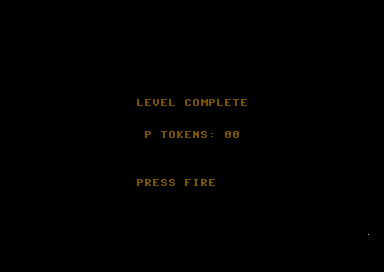
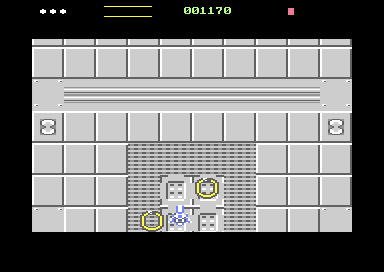

# Bank 2 boss-arena proof v1.1 — lifecycle restoration + flicker-free commit

**Date:** 2026-09-17
**Starting HEAD:** `0f7d84f` — *Boss placeholder added*, unchanged.
**Starting git status:** the uncommitted v1.0 bank 2 proof — `src/boss.asm`, `src/gamestate.asm`, `src/main.asm`, `src/renderer.asm`, `src/scroll.asm` modified; `src/vicbank.asm`, `tests/test_bank2_arena.py` and the v1.0 report untracked.
**Final git status:** the same set. No new files. **Nothing committed or pushed.**

```
 M src/boss.asm   M src/gamestate.asm   M src/main.asm
 M src/renderer.asm   M src/scroll.asm
?? src/vicbank.asm   ?? tests/test_bank2_arena.py
?? reports/bank2-boss-arena-proof.md   ?? reports/bank2-boss-arena/
```

**Result:** clean build; `tests/test_bank2_arena.py` **ALL PASS** (57 checks);
`tests/test_boss.py` **ALL PASS**; `make test` passes everything except the
`publishSkip` failure that fails identically at HEAD (§10).

| | |
|---|---|
|  |  |

`LEVEL COMPLETE` readable at `$dd00 = $97` (bank 0), and the restart running
ordinary gameplay with correctly-rendered Ring enemies — the two screens manual
play found corrupted.

---

## 1. Files changed

| file | why |
|---|---|
| `src/renderer.asm` | `frameBank` in the frame record; `exFrame` commits `$dd00` beside `$d018` |
| `src/scroll.asm` | `publishFrame` pre-computes the `$dd00` byte with the RMW |
| `src/vicbank.asm` | `vicSelectBank2` becomes a *request*; `vicSelectBank0` stays a *select-now* |
| `src/gamestate.asm` | `gsBeginNonGame` and `gsStartGame` both own the bank |
| `src/boss.asm` | unchanged in substance (call site keeps its name) |
| `tests/test_bank2_arena.py` | the three new invariants |

No new files. The v1.0 architecture is intact (§9).

---

## 2. Root cause — boss-entry flicker

`$dd00` and `$d018` are **one presentation decision made of two CPU writes**,
and v1.0 made them in two different places at two different times:

```
v1.0
  main thread, bossSpawn, arbitrary raster line   →  $dd00 = bank 2
  frame IRQ,   exFrame,   raster 250              →  $d018 = bank 2 values
```

Between those instants — up to most of a visible frame — the VIC fetched
**bank 2 through bank 0's VM and CB fields**. Bank 0's page A VM (`$0400`
bank-relative) resolves in bank 2 to CPU `$8400`, and the terrain CB (`$0800`)
to `$8800` — which is **the raster executor's own machine code**. The chip
rendered the executor as a character matrix and charset for the rest of that
frame. That is exactly the sparkle manual play saw.

### The fix — old and new sequencing

```
v1.1
  main thread, bossSpawn      →  vicBank2 = 1, clip scratch rebased. NO $dd00.
  main thread, publishFrame   →  frameBank[next] = RMW($dd00, bank bits)
  frame IRQ,   exFrame @ 250  →  sta $dd00     ← 4 cycles
                                 sta $d018     ← adjacent, same quiet window
```

**Why raster 250 is safe, and why no blanking is needed.** The aperture ends at
247, so there is no character fetch. `MAX_SPRITE_Y = 226` guarantees the last
sprite DMA was on line 246 — a constraint the renderer already documents and
relies on for the bottom aperture split. So the two stores land in the lower
border with neither fetch type active, and the VIC never sees a bank that
disagrees with its VM/CB fields.

**Why the bank goes first.** Writing `$dd00` before `$d018` means the moment
`$d018` lands the whole presentation is already coherent, rather than being
coherent only after the *second* store. Either order is safe inside this
window; this one is safe at every instant within it.

**Cost:** 8 cycles in the frame IRQ (`lda frameBank,x` + `sta $dd00`), and
about 18 on the main thread in `publishFrame` for the read-modify-write. No
second raster system, no double-buffering infrastructure, no delays, no blanked
frame.

---

## 3. Root cause — corrupted `LEVEL COMPLETE`

`gsAttractIrq` establishes `$d011`, `$d018`, `$d015`, `$d020` and `$d021`
explicitly, and `gsBeginNonGame` adds the multicolour bit and clears the screen.
**None of them touched the VIC bank**, because until the boss arena existed
there was only one.

Arriving from the boss meant arriving in bank 2, where `GS_D018 = $14` names
VM `$0400` → CPU **`$8400`**, not `$0400`. The page rendered the bytes near the
clip code as a character matrix.

**The font was correct**, which is the detail that identifies the cause beyond
doubt: `GS_D018`'s CB field selects bank-relative `$1000`, and banks 0 and 2
*both* show the character ROM there. Garbage characters in a legible typeface is
the precise signature of a wrong matrix with a right charset.

### Presentation established on entering `GS_LEVELDONE`

`gsBeginNonGame` now calls `vicSelectBank0`, so every non-game state — attract,
game over, initials and level-done alike — owns a known bank. Full contract:

| register / state | value | set by |
|---|---|---|
| **VIC bank** | **bank 0 (`$dd00` bits 0-1 = `%11`)** | **`vicSelectBank0` (new)** |
| `vicBank2` flag | 0 | `vicSelectBank0` (new) |
| clip scratch base | bank 0 | `vicClipRebase` (new) |
| `gsNonGame` | 1 | `gsBeginNonGame` |
| `$d011` | `GS_D011` | `gsAttractIrq`, every frame |
| `$d018` | `GS_D018` = `$14` | `gsAttractIrq`, every frame |
| `$d015` | 0 — no sprite of any kind | `gsAttractIrq`, every frame |
| `$d020` / `$d021` | 0 | `gsAttractIrq`, every frame |
| `$d016` multicolour | off (text is hires) | `gsBeginNonGame` |
| screen matrix | cleared, then stamped | `gsClearScreen` / `gsDrawLevelDone` |

**One ordering hazard I introduced and then closed.** My first version called
`vicSelectBank0` *before* `sta gsNonGame`. While that byte is clear the frame
IRQ is still `exFrame`, which commits `$dd00` from the frame record every
frame — so the very next IRQ would have put the machine straight back into
bank 2, with no executor left to undo it. `gsNonGame` is now set first, and the
comment in the source says why.

---

## 4. Root cause — restart scroll snap

`gsStartGame` calls `gsResetRun`, `gameInit`, `hudInit`, `scrollInit` and
`gsEnterGame`. The scroll model itself was never the problem: `scrollInit`
already resets `scrollFine`, `worldProgress`, `stageComplete`, `stageTopRow`
and `dispPage`, and rebuilds both pages.

What it did **not** do was establish the bank — and critically, **`vicBank2` was
still set**. So `scrollInit`'s frame 0 was published carrying `D018_BOSS`
(`$3a`) and `framePtrHi` `$8f`, and `$dd00` was still bank 2.

In bank 2, `$3a`'s VM field names CPU `$8c00` — **the bank 2 screen matrix,
still holding the frozen photograph of the boss arena**. So the restart
displayed the old arena image while the scroller advanced pages nobody was
looking at. `$d011`'s fine scroll still moved that stale image a pixel at a
time, and at each coarse step the page flipped to a page that was not on
display — which is precisely "scrolls roughly one character and then snaps back
immediately."

---

## 5. Root cause — restart enemy-animation corruption

Not stale animation state, and not stale pointer *values*. Two things
compounded:

1. **The pointer destination was still the bank 2 table.** `framePtrHi = $8f`
   meant the mux wrote pointers to `$8ff8` — which in bank 2 *is* the live
   table, so pointers were written correctly but to a screen showing the frozen
   arena.

2. **The v1.0 mirror overlaps the enemy window, and that is a real flaw in
   v1.0.** `vicMirrorStatic` copies `$2000-$3fff → $a000-$bfff` and then lays
   the terrain charset over `$a800-$afff`. The level enemy window mirrors to
   `$ac00-$b0ff`, so **`$ac00-$afff` — 16 sprite blocks — is overwritten by
   charset bytes**:

   ```
   level1 ring frames     $2c00-$2cff → $ac00   CLOBBERED by the charset
   level1 dropper frames  $2d00-$2dff → $ad00   CLOBBERED by the charset
   window tail            $3000-$30ff → $b000   intact
   ```

   A pointer of `$b0` (the Ring) therefore resolved onto terrain-charset data.
   Some blocks happened to look like a sprite and others did not — exactly
   "correct on some animation frames and corrupted on others."

**This was harmless in the boss arena** (frozen scroll, empty arena, no enemy
ever fetched) and only became visible when ordinary gameplay ran in bank 2.

**Fixed at the ownership boundary, not by mirroring more art.** Ordinary
gameplay is in bank 0, where the enemy window is untouched. The overlap remains
a documented property of the mirror and a caveat for a future real boss (§12) —
the brief explicitly rules out copying Level 1 animation frames into bank 2 to
hide a lifecycle bug, and I have not.

---

## 6. The ordinary-gameplay bank 0 contract

`gsStartGame` — **the seam, not the FIRE handler** — now begins:

```asm
gsStartGame:
    ...count the game...
    jsr vicSelectBank0        ← FIRST: bank, flag and clip base
    jsr gsResetRun
    jsr gameInit
    jsr hudInit
    jsr scrollInit            ← publishes frame 0, now with bank 0 values
    jsr gsEnterGame
```

The ordering is the substance. `vicSelectBank0` runs **before** `scrollInit`
because `scrollInit` ends by publishing frame 0, and a record published while
`vicBank2` was still set would carry the boss's `$d018` and pointer destination
into ordinary play. It also runs while `gsNonGame` is still 1, so writing
`$dd00` directly is correct — there is no executor adopting frame records to
synchronise with.

Everything else was already established by the existing inits and is unchanged:
screen matrix and both terrain pages (`scrollInit`), charset selection (the
frame record's `$d018` pair), sprite-pointer table destination (`framePtrHi`),
scroll coarse/fine (`scrollInit`), schedule and sprite enables (`gameInit`,
then `gsEnterGame` hands the display back last). Score, lives and P currency
remain `gsResetRun`'s business — **no run state was touched to fix presentation
state.**

This is the seam the upgrade screen and Level 2 will use.

---

## 7. `$DD00` unrelated bits

**Preserved, and still proved against a hostile pattern.** The read-modify-write
moved from `vicSelectBank2` into `publishFrame`, where it reads the live
`$dd00`, masks with `VIC_BANK_KEEP = %11111100` and ORs the two select bits;
the frame IRQ stores only the finished byte. `vicSelectBank0` does the same RMW
inline.

Measured this run: `$3f → $3f` across a `vicSelectBank0` with every foreign bit
driven high, and the arena runs at `$dd00 = $95`/`$97` — upper bits differing
between runs because they are whatever the autostart left, which is the point.

---

## 8. v1.0 bank 2 behaviour still intact

Every v1.0 property is still asserted and still passes:

- boss arena reaches bank 2, with `$d018` `$3a` / blank `$3e` / pointer `$8f`;
- the frozen screen matrix crosses intact at three offsets;
- terrain charset, blank charset, player, boss cells and HUD all match bank 0;
- **sprite pointer values unchanged** — boss cells still `$d6-$d9`;
- boss 50 HP, takes damage, dies, victory, scripted exit;
- lives and P unchanged from `LP_BOSS` through `LEVEL COMPLETE`;
- renderer/mux/raster/clipping untouched in substance; the raster executor is
  still at `$8600` and was not moved.

---

## 9. Focused tests run, and final results

| gate | result |
|---|---|
| clean build | **pass** |
| `tests/test_bank2_arena.py` (57 checks) | **ALL PASS** |
| `tests/test_boss.py` (committed regression) | **ALL PASS** |
| `make test` (engine invariant probe) | all pass except `publishSkip` (§10) |

New v1.1 evidence:

```
vicSelectBank2 records the intent and does NOT write $dd00   $3f -> $3f
LEVEL COMPLETE returned the VIC to bank 0                    $dd00 = $97
  ...vicBank2 clear, $d018 = $15 (GS_D018, bit 0 reads as 1)
  ...LEVEL COMPLETE text present in the DISPLAYED matrix     [12,5,22,5,12]
FIRE restarted ordinary gameplay                             gsState 1
  ...in VIC bank 0                                           $dd00 = $97
  ...frame record back to a bank 0 $d018                     $a2
  ...pointer destination back to a bank 0 table              $2b
  ...committed bank byte agrees with the hardware            frameBank $97
  ...scroll restarted from the top of the map                stageComplete 0
  ...lvlPhase back to LP_LEVEL                               0
  ...enemy pointer $b2 -> $2c80 = real Ring art, not charset bytes
arena lifecycle: gameOverrun scrollLate statPageMismatch statPtrMismatch
                 schedBuildDefer objDoubleFree objAllocFail  all 0
restarted play:  the same seven                              all 0
```

**One measurement I split rather than forced.** The restart transition costs
`schedBuildDefer = 1`. That is `gsStartGame` rebuilding both terrain pages and
republishing everything in one main-thread pass — behaviour its own comment
already documents ("costs exactly one `gameOverrun` … of the frame that STARTS
the game"), and it zeroes `gameOverrun` afterwards for that reason. So the gate
now asks the two honest questions separately: the arena lifecycle is clean, and
ordinary play *after* the restart is clean. Both are zero. I did not weaken the
assertion to cover the transition.

---

## 10. Unrelated failures, observed and untouched

- **`make test` → `publishSkip is zero over 10s of ordinary play`.** Verified in
  the v1.0 report to fail identically at HEAD (built into `/tmp` from
  `git archive` and run with its own symbols). Pre-existing, not investigated,
  not repaired.
- **`harness.Vice._boot_to_game` is fragile now the level is finite** — up to
  eight fire presses with a second of warp each can run whole levels and land in
  `GS_INITIALS`. It bit my *capture script* once during this work, not the
  product. `tests/harness.py` was **not modified**.

No test or harness was changed to manufacture a green result.

---

## 11. Manual VICE checks still required

Manual, non-warp play is authoritative and has not been done. Please verify:

1. **The final level → boss transition has no visible flicker.** This is the one
   fix whose whole point is visual; the automated proof can show *when* the
   registers are written but not that the screen is clean.
2. **The boss arena is visually identical to before.**
3. **The boss fight still works** — hit flash, health bar, 50 HP, death.
4. **`LEVEL COMPLETE` is readable and stable** after the exit.
5. **FIRE restart begins cleanly, with no 8-pixel scroll/snap.**
6. **Enemy sprites animate correctly through all frames after restart.**
7. **HUD, player, muzzle and projectiles remain correct**, including the clipped
   ship rising through the top of the aperture on the exit.
8. **No new border or aperture corruption** over a long run.

---

## 12. Disk

```
du -sh build/   96K
du -sh .        6.9M
```

---

## 13. Caveat for `UPGRADE → Level 2`

`gsStartGame` is now the deterministic bank 0 entry seam, and an upgrade screen
between the boss and Level 2 gets bank 0 for free because it is a non-game state
and `gsBeginNonGame` owns the bank.

Two things a real Level 2 will need to face:

- **The mirror's enemy-window overlap (§5) is still there.** It is harmless while
  only the boss arena uses bank 2, but a future boss phase that wants live
  enemies in bank 2 must give the terrain charset a different 2 KB block first.
  That is the same constraint the v1.0 report flagged, now with a concrete
  demonstration of what it looks like when it bites.
- **`vicMirrorStatic` runs once, at boot, from bank 0's art.** A level 2 that
  loads different artwork must re-run it after loading, or bank 2 will still
  hold level 1's.

**Nothing committed. Nothing pushed.**
