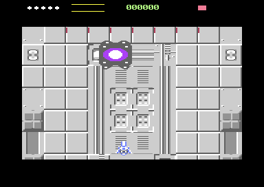

# Bank 2 boss-arena VIC proof

**Date:** 2026-09-17
**Starting HEAD:** `0f7d84f` — *Boss placeholder added*
**Starting git status:** **clean.** Nothing uncommitted, nothing to preserve.
**Final git status:** five modified, three new. **Nothing committed or pushed.**

```
 M src/boss.asm   M src/gamestate.asm   M src/main.asm
 M src/renderer.asm   M src/scroll.asm
?? src/vicbank.asm   ?? tests/test_bank2_arena.py   ?? reports/bank2-boss-arena/
```

**Result:** clean build; the focused proof **ALL PASS** (39 checks); the committed
`tests/test_boss.py` **ALL PASS**; `make test` passes every check except a
`publishSkip` failure that **fails identically at HEAD** (§9).



The arena with `$dd00 = $95` (bits 0-1 = `%01` = bank 2), `vicBank2 = 1`,
`lvlPhase = LP_BOSS`, `bossHP = 50`. Terrain, boss, ship, HUD and borders all
correct, fetched entirely from `$8000-$bfff`.

---

## 1. Files changed

| file | why |
|---|---|
| **`src/vicbank.asm`** *(new, 318 B code, 8 B state)* | the bank selection, the copies, the clip rebase |
| `src/main.asm` | the bank 2 layout constants (with the memory map), the import, `vicBankInit` at boot, `vicMirrorStatic` after `hudInit` |
| `src/scroll.asm` | `publishFrame` emits the bank 2 `$d018` pair and pointer destination |
| `src/boss.asm` | arm the screen mirror at `LP_CLEARING`, walk it during clearing, switch at `bossSpawn` |
| `src/gamestate.asm` | **relocated** `$8b00` → `$9700` (§5) |
| `src/renderer.asm` | the pointer self-check learns the third screen (§8) |
| **`tests/test_bank2_arena.py`** *(new)* | the focused proof |

Not touched: the mux, the schedule, the clipping algorithm, the boss, the SID,
collision, the object pool, the level asset indirection.

---

## 2. The one rule that made this cheap

A sprite pointer and the VM/CB fields of `$d018` are **bank-relative**. If a
thing sits at the same offset in both banks, every number the renderer already
computes for it is correct in both — no mapping table, no bank test in hot code.

So the sprite region is mirrored at exactly **bank-0 address + `$8000`**, and
**not one sprite pointer value changes when the bank does.** Two things could
not keep their offsets because CPU code already occupies those addresses in
bank 2 — the screen matrix and the terrain charset — and the entire cost of
that is three constants consumed by `publishFrame`.

---

## 3. Memory ranges

### Bank 0 (`$0000-$3fff`) — unchanged

```
$0340-$03ff  clip scratch, 3 of 12 blocks
$0400-$07ff  screen page A          pointers $07f8
$0800-$0fff  terrain charset        (glyphs $0b00-$0d3f, turrets $0f10-$0f2f)
$1000-$1fff  character ROM shadow — CPU code only, never fetched
$2000-$27bf  player bitmaps, muzzle flash, token, fireball
$2800-$2bff  screen page B          pointers $2bf8
$2c00-$30ff  level enemy sprite window
$3100-$31ff  clip scratch, 4 blocks
$3200-$357f  HUD bitmaps            pointers $c8-$d5
$3580-$367f  boss cells             pointers $d6-$d9
$3680-$37ff  clip scratch + hostile projectile
$3800-$3fff  blank charset, idle byte $3fff
```

### Bank 2 (`$8000-$bfff`) — what the VIC fetches there now

| range | contents | bank-relative |
|---|---|---|
| `$8340-$83ff` | clip scratch, 3 blocks (written via the rebase) | `$0340` — **same** |
| `$8c00-$8fff` | **screen matrix**, pointers at `$8ff8` | `$0c00` — **moved** |
| `$a000-$a7bf` | player, muzzle, token, fireball | `$2000` — same |
| `$a800-$afff` | **terrain charset** | `$2800` — **moved** |
| `$b100-$b7ff` | clip scratch, HUD, boss cells, projectile | `$3100` — same |
| `$b800-$bfff` | blank charset, **idle byte `$bfff`** | `$3800` — same |

### CPU code that stays in bank 2, and why it is safe

```
$8000-$8116  clipped-sprite renderer   rel $0000-$0116  nothing points there
$8600-$8aa8  THE RASTER EXECUTOR       rel $0600-$0aa8  nothing points there
$9400-$9688  boss code                 } the character ROM shadow: the VIC reads
$9700-$9c58  game state code           } ROM at rel $1000-$1fff in banks 0 and 2
                                         alike, so RAM here can never be fetched
```

**The raster executor is deliberately NOT moved.** It is the most
timing-sensitive code in the project, its placement is justified by measurement,
and relocating it would change which of its branches cross a page boundary. The
bank 2 layout is chosen *around* it — which is the whole reason the screen and
charset moved instead.

---

## 4. `$DD00` selection, exactly

```asm
vicSelectBank2:
    lda #>VB2_BASE
    jsr vicClipRebase                   // clip writes follow the VIC
    lda CIA2_PRA
    and #VIC_BANK_KEEP                  // %11111100 — keep the six that are
    ora #VIC_BANK_2                     // %00000001 — bank 2, inverted
    sta CIA2_PRA
```

`vicSelectBank0` is the same with `VIC_BANK_0 = %00000011`. Read, mask, OR,
write: bits 2-7 carry the serial bus's CLK/DATA/ATN and the RS-232 lines, and
writing a literal would be writing six bits that are not ours.

`vicBankInit` also forces the two select lines to **outputs** in `$dd02`
(`ora #%00000011`, preserving the other six directions) rather than inheriting
the KERNAL's setup, since this game banks the KERNAL out.

**Proved against a hostile pattern**: the test drives every foreign bit high,
then selects each bank and checks those six survived — `$3f → $3d → $3f`.

---

## 5. The one relocation

`game state code` moved `$8b00` → `$9700`, into the character ROM shadow. It
had to: `$8b00` is bank-relative `$0b00`, underneath where bank 2 now keeps its
screen matrix. It is not timing-critical — `gsAttractIrq` only runs while
`gsNonGame` is set, which is never during gameplay — and its size guard changed
from "must not reach the schedule buffers at `$c000`" to "must not leave the ROM
shadow at `$9fff`", which is a stricter statement.

Nothing else moved. In particular the raster executor did not.

---

## 6. `$d018`, the screen and the charsets in bank 2

```
VM = (screen  - $8000) / $0400  in bits 7-4   →  $0c00 / $0400 = 3  →  $30
CB = (charset - $8000) / $0800  in bits 3-1   →  $2800 / $0800 = 5  →  $0a
CB = (blank   - $8000) / $0800  in bits 3-1   →  $3800 / $0800 = 7  →  $0e

D018_BOSS       = $3a      terrain charset
D018_BOSS_BLANK = $3e      blank charset (the aperture's other value)
framePtrHi      = $8f      pointer table at $8ff8
```

All three are computed from the addresses by the assembler, not typed, and
asserted for 1 KB / 2 KB alignment, for staying out of the ROM shadow, for not
overlapping `rasterExecutorEnd`, and for the blank charset ending exactly on
`$bfff` — the VIC's idle fetch.

The terrain charset lands on the space bank 0 gives to **screen page B and the
head of the level enemy window**. Neither is fetched in the arena: the scroll is
frozen so there is no page to flip to, and the arena is empty so there are no
enemies. That is what made a 2 KB hole available without moving anything.

**The bank 2 `$d018` reaches the renderer as data, not as code.** `publishFrame`
— the single place the frame record is written, and a routine that still runs
every frame while the scroll is frozen — picks the pair on one `lda vicBank2`.
No mux code, no schedule entry and no clipping decision learns that banks exist.

---

## 7. Sprite pointers

**Unchanged, and that is the result.** The mirror keeps every sprite block at its
bank-0 bank-relative offset, so every pointer the mux computes is already
correct. Measured in the arena: the pointer table at `$8ff8` reads
`[$86, $8f, $d6, $d7, $d8, $d9, $cb, $d5]` — the player, the muzzle, the four
boss cells at `$3580/64 = $d6..$d9`, and two HUD sprites. Those are the bank-0
numbers.

The per-level enemy animation indirection was not touched: it resolves pointers
through `levelAssetsLoad` from the window at rel `$2c00`, which the mirror
carries at `$ac00` unchanged. (The arena is empty, so it is not fetched — but it
is present and at the right offset if a future boss wants it.)

---

## 8. Hidden bank-0 assumptions found

1. **Nothing ever selected bank 0.** `$dd00` was not written anywhere in the
   codebase; the game ran in bank 0 because that is where reset leaves the
   machine. Resolved: `vicBankInit` says so at boot, and `$dd02` is asserted.

2. **The raster executor's home is justified by "the VIC never reads it"** —
   true only in bank 0. Resolved by documenting it and choosing the bank 2
   layout around it rather than moving it.

3. **The clip scratch CPU write address equals the VIC fetch address.** True
   only in bank 0. `src/clip.asm` writes through `clipBlkHi`, a table of high
   bytes, so `vicClipRebase` adds `$80` to all twelve once per bank change —
   zero per-frame cost. `clipBlkPtr`, the *pointer* value, is deliberately not
   touched: it is bank-relative and already right. This matters because the
   player is clipped during the scripted exit, when it rises above the aperture.

4. **The HUD renders into fixed bank-0 addresses** and keeps rendering during
   the arena (heat, score). Resolved by mirroring the block a 128-byte slice per
   frame from `LP_CLEARING` onward, so `src/hud.asm` is **unchanged**.

5. **The renderer's own pointer self-check knew exactly two screens.** It derives
   the expected pointer table from `$d018`'s VM nibble; in bank 2 the nibble
   (`$30`) matched neither, so it fell through to "must be page B" and counted a
   perfectly correct destination as a fault on every frame — `statPtrMismatch`
   saturated at 255. **The display was right and the instrument was wrong**,
   which is the failure mode this repository's own notes warn about hardest. It
   now knows the third case, still derived from the register.

Assumptions checked and found **absent**: the screen matrix is static during the
arena (`hudTick` is the disabled `HUD_VISIBLE` diagnostic; the boss health bar
writes **colour RAM**, which is not in any bank); sprite colours are
bank-independent.

---

## 9. Tests run, and final results

| gate | result |
|---|---|
| clean build | **pass** |
| `tests/test_bank2_arena.py` (focused, 39 checks) | **ALL PASS** |
| `tests/test_boss.py` (committed boss regression) | **ALL PASS** |
| `make test` (engine invariant probe) | every check passes **except** `publishSkip`, which **fails identically at HEAD** |

Selected measurements from the focused proof:

```
$dd00 $3f -> $3d -> $3f      bank 2, bank 0, six foreign bits preserved
ordinary play  $dd00 = $3f   $d018 = $a2   (bank 0, chosen)
arena          $dd00 = $3d   $d018 = $3a   blank $3e   ptrHi $8f
screen matrix crossed intact at +$000, +$190, +$3e0
terrain charset, blank charset, player, boss cells and HUD all match bank 0
pointer table  [$86,$8f,$d6,$d7,$d8,$d9,$cb,$d5]  — bank 0 values
boss 50 HP -> damaged -> dead -> LP_VICTORY -> GS_LEVELDONE, still in bank 2
lives and P unchanged from LP_BOSS through LEVEL COMPLETE
gameOverrun scrollLate statPageMismatch statPtrMismatch schedBuildDefer
objDoubleFree objAllocFail  — all 0.   publishSkip 0, clipPoolFull 0
```

### The two things I got wrong on the way, and how they were settled

- **`schedBuildDefer` read 2, then 1.** Partly real: the screen copy was a
  ~10,000-cycle spike in one frame. Fixed properly by slicing it across
  `LP_CLEARING` (128 bytes a frame) with `vicMirrorFinish` to guarantee
  completion if clearing is short. The remainder was **my test measuring the
  boot**: the committed `test_boss.py` zeroes the counters before its smoke and
  I had not. Measured directly afterwards — the arena lifecycle's own
  contribution is **0**.
- **My first HEAD A/B was invalid**: it booted HEAD's binary with the working
  tree's symbol addresses. Redone by building HEAD into `/tmp` as a full tree
  and running the same probe from inside it.

### Unrelated failures, observed and intentionally untouched

- **`make test` → `publishSkip is zero over 10s of ordinary play`.** Fails at
  HEAD with the identical message. Pre-existing, recorded in previous reports as
  a known limitation, and not investigated or repaired here.
- **`harness.Vice._boot_to_game` is fragile now the level is finite**: it presses
  fire up to eight times with a second of warp between, which on a finite stage
  can run whole levels and land in `GS_INITIALS`. It flaked once during this
  work. `tests/harness.py` was **not modified**.

---

## 10. Where the switch happens, and how the terrain survives it

```
LP_LEVEL → LP_CLEARING → LP_BOSS → LP_VICTORY → LP_EXIT → LP_DONE → GS_LEVELDONE
              ^ arm + walk           ^ switch
```

`bossSpawn`, **before** the four cells are allocated, so the first frame that
has a boss in it is already a bank 2 frame — there is no half-switched frame.
The bank changes from the main thread between frames, and the picture on both
sides of it is the same picture. **No raster cleverness.**

**The frozen terrain survives because it is a photograph, not a feed.** The
scroll freezes on the coarse step that sets `stageComplete` — which is the same
event that enters `LP_CLEARING` — with `scrollFine` at zero and the authored top
row exactly at matrix row 0. From that instruction the matrix is final, so
`vicMirrorScreen` arms the copy and `bossClearTick` walks all 1 KB across a
slice a frame. Nothing writes it again, in either bank.

The static set — sprite art, both charsets — is copied **at boot** by
`vicMirrorStatic` (two block copies, after `clearCharset` and `hudInit`), so the
transition costs nothing anyone can see.

---

## 11. Disk

```
du -sh build/   96K
du -sh .        6.9M
```

`build/shmup.prg` is 51,164 bytes — unchanged in size, as the image spans fixed
segment bounds.

---

## 12. Manual VICE checks remaining

Manual, non-warp observation is authoritative and has not been done. The
headless capture above shows the arena composing correctly, but a human should
confirm:

1. **Terrain equivalence** — the frozen arena looks byte-identical to what
   bank 0 showed a moment earlier (the test proves the bytes; the eye proves the
   picture).
2. **The switch frame itself** — no flash, tear, colour blink or one-frame
   garbage as `$dd00` changes.
3. **HUD liveness** — heat responds to firing at the boss with no visible lag
   from the slice mirror (7 frames worst case).
4. **Muzzle and player** during the fight, and the **clipped ship** as it rises
   through the top of the aperture on the exit — that is the clip rebase being
   exercised for real.
5. **Boss composition** — the bright core across both seams, the hit flash on
   all four cells, the health bar.
6. **Borders and aperture** unchanged; no flicker or corruption over a long run.
7. **Victory, exit and LEVEL COMPLETE** presentation, and the launch SFX.

---

## 13. Caveats for real boss assets and the return to bank 0

- **The return path exists and is tested, but is not yet called.** The proof ends
  at `GS_LEVELDONE` with bank 2 still selected. A second level's init calls
  `vicSelectBank0` on its first instruction; it restores the clip rebase as well
  as the bank, and `publishFrame` reverts to the page A/B values on the same
  flag.
- **Bank 2's free room for a real boss.** The layout leaves `$8117-$833f`,
  `$8400-$85ff` and `$8aa9-$8bff` unused, and the mirror currently spends
  `$ac00-$b0ff` on a copy of the level enemy window the arena never fetches —
  about 1.25 KB a real boss could take for its own cells by narrowing
  `vicMirrorStatic`'s copy list. That list is one routine and is the intended
  edit point.
- **The terrain charset's home is borrowed.** It sits on page B + the enemy
  window precisely *because* the arena needs neither. A future boss that wants
  scrolling terrain or live enemies in bank 2 must give the charset a different
  2 KB block — and at that point the raster executor's position becomes the
  binding constraint again.
- **The HUD mirror is a slice walk, not a redirect.** It is correct and cheap for
  a frozen arena. A boss phase with a genuinely busy HUD would be better served
  by rebasing the HUD's own store addresses, the way `vicClipRebase` does for
  clipping.
- **`vicMirrorStatic` copies 10 KB at boot.** It is one-time and invisible, but it
  is also the only thing keeping bank 2 in step with build-time art: change a
  sprite and both banks get it, because one is copied from the other.
- **Nothing here is a loader.** There are two banks, two routines and one flag.

**Nothing committed. Nothing pushed.**
