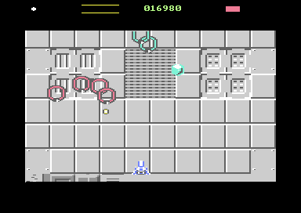
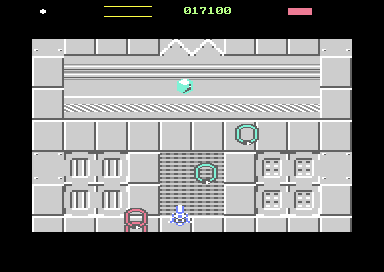

# Dropper Flight v1 — three upper-screen passes + priority sonar ping

**Date:** 2026-09-16
**Starting HEAD:** `d105f77` — *Powerup tokens added* (unchanged; nothing committed)

**Starting working tree:** the uncommitted Token Encounter v2 / v2.1 slice — `src/enemy.asm`, `src/main.asm`, `src/objects.asm`, `src/pickup.asm`, `src/waves.asm` modified; `src/token.asm`, `tests/test_token_encounter.py` and the two v2/v2.1 reports untracked.

**Final working tree:** the same, plus `src/sfx.asm` modified and `src/dropper.asm`, `tests/test_dropper_flight.py`, this report and its captures new. No reset, clean, stash, commit or push; no unrelated file touched.

```
 M src/enemy.asm   M src/main.asm   M src/objects.asm
 M src/pickup.asm  M src/sfx.asm    M src/waves.asm
?? src/dropper.asm            ?? tests/test_dropper_flight.py
?? reports/dropper-flight-v1.md    ?? reports/dropper-flight-v1/
   (+ the untracked v2 / v2.1 files, unchanged)
```

**Result:** build clean, focused proof **ALL PASS** (43 checks), free-running smoke clean. No unrelated test run or modified.

---

## 1. What it does now

A Dropper no longer rides the wave path it was authored into. It enters
horizontally from an authored side, high up, weaves across the screen three
times, and leaves through the **opposite** border if it is not killed — pinging
once a second the whole way. Killing it still drops the P exactly where it died
and still starts the v2.1 protector encounter, untouched.




Two headless captures. The Dropper (cyan) is at `(210,97)` and `(162,88)`,
clearly above the Rings working the middle and lower playfield.

---

## 2. Files changed

| file | why |
|---|---|
| **`src/dropper.asm`** *(new, 281 B code+table, 7 B state)* | the whole flight: launch, the weave, three passes, the escape, and the ping's cadence |
| `src/sfx.asm` | `SFX_PING` — a new effect — and the one voice-2 protection rule |
| `src/waves.asm` | the authored `trigSide` column, its emission table, its per-instance latch, and the `dropperLaunch` call |
| `src/enemy.asm` | one species branch in `enemyTick`'s movement dispatch |
| `src/main.asm` | the import (before `waves.asm`) and `dropperInit` at cold start |
| **`tests/test_dropper_flight.py`** *(new)* | the focused proof |

---

## 3. Movement state and entry side

### Flight state — four bytes, not four arrays

`drPassLeft`, `drPhase`, `drHold`, `drPing` are **module bytes**, not
sixteen-entry arrays, because there is never more than one live Dropper —
`src/waves.asm` enforces that at the single instruction that commits a species
to an object. That is a saving of forty-odd bytes and, more to the point, it is
the truth: these describe *the* Dropper.

**The direction is not stored at all.** It is the sign of `wmVX`, which this
file keeps truthful — see §5.

### Entry side — one authored column

A fifth trigger column beside the four that already exist:

```asm
.var trigSide = List().add(DROP_SIDE_LEFT, DROP_SIDE_LEFT,
                           DROP_SIDE_LEFT, DROP_SIDE_RIGHT)
```

Emitted as `waveTrigSide`, latched onto the instance as `wvSide` when the wave
is armed (the same moment and for the same reason as `wvFire` and `wvSpecies`),
and read once, at launch. It is **a column and not a rule** for exactly the
reason `trigSpecies` is one: "alternate the sides" would be arithmetic on the
cursor that silently inverts for every trigger after an inserted fifth.

A byte rather than a bit, to match the shape of the four columns beside it. It
is meaningless for a Ring wave and latched unconditionally anyway — one copy
beats a branch that has to know what a species is.

**Level 1 exercises both sides**: trigger 1 is a Dropper from the left, trigger
3 a Dropper from the right, and the proof watches one of each.

---

## 4. The flight

| constant | value | why |
|---|---|---|
| `DROP_CENTRE_Y` | 88 | the aperture is 55..247; this is the upper third |
| `DROP_AMPLITUDE` | 16 | keeps `logY` inside **72..104** — measured, every frame |
| `DROP_PHASES` | 32 | a sine table generated by the assembler's own `sin()` |
| `DROP_PHASE_HOLD` | 2 frames | a 64-frame weave cycle, ~1.5 weaves per crossing |
| `DROP_VX` | 12 qpx = **3 px/frame** | a crossing is ~99 frames, the whole flight ~312 |
| `DROP_X_LEFT` / `DROP_X_RIGHT` | 24 / 320 | the **visible** edges, so the reversal happens on screen |
| `DROP_ENTRY_LEFT` / `_RIGHT` | 0 / 343 | outside the window, so it slides in through the border |
| `DROP_PASSES` | 3 | odd, so the exit side is the opposite of the entry side |

The largest step between adjacent weave phases is 3 px, so at a two-frame hold
the vertical moves at most 1.5 px/frame — slower than the horizontal, which is
what makes it read as a shallow wave rather than a zigzag.

`DROP_PASSES` being odd is asserted at assembly time; an even count would send
the Dropper back out of the border it came in through.

### Passes, reversals and escape

`drPassLeft` starts at 3. On reaching a far edge it is decremented; if it is
still non-zero the velocity is negated and `wmAccX` cleared so the turn starts
from a whole pixel. When it reaches **zero nothing is reversed** — the Dropper
flies on and `src/enemy.asm`'s ordinary side despawn rule retires it.

The turn test is skipped entirely once `drPassLeft` is zero, and it has to be:
the Dropper is then past the turning point and getting further past it every
frame, so a test that still ran would turn it round on every one of them.

**Measured, from the machine:** entered `x=0` heading right, passes
`[3, 2, 1, 0]`, reversals at frames 107 and 206, exited at `x=342` still
heading right — 312 frames end to end.

### The vertical is not the movement interpreter

`logY` is written outright as `DROP_CENTRE_Y + weave[drPhase]`. The **horizontal
still goes through `wmApplyVelocity`**, because nine-bit signed quarter-pixel
travel is exactly what that routine already does correctly and a second copy
here would be a second thing to get wrong.

The proof asserts `logY == centre + weave[phase]` on *every* frame, that `wmVY`
stays zero, and that the Dropper's `wmStage` never advances — while ordinary
Rings on screen are still running the interpreter with real velocities.

---

## 5. Stale movement state — the v2.1 lesson applied

`dropperLaunch` zeroes `wmVY`, `wmAccX` and `wmAccY`, and keeps `wmVX`
**truthful** for the whole flight.

That is not tidiness. v2.1 gave `src/enemy.asm` a top despawn edge that frees an
enemy which is above the aperture *and travelling up*, and the side edges have
always read `wmVX` to tell an enemy arriving through a border from one leaving
through it. A Dropper carrying a stale upward `wmVY` from the wave stage it was
armed with would be retired in mid-flight; a stale `wmVX` would confuse the side
rules at both turning points.

Keeping `wmVX` honest also means **the escape needs no new despawn rule at
all** — the existing right/left rules already agree that a Dropper heading out
of the border it is behind has left.

### Launch order

`dropperLaunch` is called **after `wmEnterStage`**, not before. The wave arms
every member's movement program from its definition, writing `wmMode`, `wmVX`,
`wmVY` and `wmTimer`; a flight installed before that would be overwritten a
dozen instructions later. So the Dropper is armed like any other member and then
taken over — which also means there is never a half-configured object.

---

## 6. Firing policy

**Disabled for the whole flight.** `dropperLaunch` writes `ENEMY_FIRE_NONE` to
`enyFire`.

The authored mask in `src/waves.asm` grants firing knowing the path the member
will fly — a formation crossing the aperture once, from which a downward bolt is
a fair threat. A Dropper is no longer on that path: it sits high and crosses
three times, so the same authored byte would produce three times the fire from a
place the player cannot answer. The permission is withdrawn with the path it was
granted for — the same rule `tokenSilence` applies to a protector.

Its challenge is finding, tracking and killing it before it escapes, then
surviving the protectors. `src/ebullet.asm` and the firing tick are untouched.

---

## 7. The sonar ping

### The sound

A new effect, `SFX_PING`, id 6, on voice 2:

| | |
|---|---|
| waveform | **pulse at 50% duty** (`$08`) — the only 50% duty in the game; the enemy shot's is a thin `$02` and the token chime is a triangle, so it cannot be confused with either on the same voice |
| sweep | 4 frames, **2100 → 1925 Hz** — a *settle*, not a sweep. Barely a whole tone, which the ear hears as one pitch with a slight give in it |
| envelope | attack 0, **decay 6 (204 ms)**, sustain 0 — the gate is held for only 80 ms; the rest of what is heard is the envelope falling away. That decay *is* the resonance |
| total | ~210 ms of sound in a 960 ms period — roughly three-quarters of a second of silence between pings |

### Cadence

`DROP_PING_PERIOD = 48` frames, first ping at `DROP_PING_FIRST = 8` frames after
launch — at 3 px/frame the Dropper is meaningfully on screen by then, and the
ping is what tells the player to look for it.

**Measured: 7 pings over the flight, gaps `{48}` — every one exact.**

### It stops by itself

The ping is driven from `dropperFly`, which runs only while a Dropper is alive
and moving: `src/enemy.asm` sends a *dying* enemy to `enemyDeathTick` before it
ever reaches the movement call, and a despawned one no longer exists. So there
is no "stop the ping" path to get wrong, no queue and no trailing ping — the
sound stops because the thing making it stopped. The proof checks this for both
endings (escape and destruction) by watching `drPinged` stay frozen for two
further periods.

### Voice-2 priority — why it is a rule and not a number

The requirement is genuinely non-transitive:

```
ping  >  eshot, token      the ping must beat routine voice-2 traffic
kill  >= ping              a destruction must never be masked
kill  == eshot             ...but those two are still peers, as they always were
```

No single priority *number* can express that. Give `SFX_KILL` a rank above the
ping and an enemy shot silently stops being audible during a destruction —
behaviour nobody asked to change. So the test names the one protected sound
instead of ranking all seven:

```asm
    lda sfxChId,y
    cmp #SFX_PING
    bne !accept+                        // nothing else is ever protected
    lda sfxReqId
    cmp #SFX_PING
    beq !accept+                        // a ping may retrigger a ping
    cmp #SFX_KILL
    beq !accept+                        // ...and a destruction ends one
    (refused, counted in sfxRefused)
!accept:
```

**The ping does not reserve voice 2.** This looks at what is *playing*, and
`sfxChannel` returns the voice to `SFX_NONE` the moment an effect finishes — so
between pings the first instruction falls straight through and voice 2 behaves
exactly as it always did. Measured: the ping held voice 2 on **35 of 312 frames
(11.2%)**, and the voice was idle on **265**.

`sfxRefused` is back as a diagnostic. It was removed when global priority was,
because with a voice per effect nothing could ever be refused; the ping
reintroduces exactly one way, so the counter is worth its byte again — and it is
how the proof tells "protected" from "lucky".

### Destruction is never masked

`SFX_KILL` is let through explicitly. The Dropper's own death is the feedback
that ends the encounter the ping was announcing; hearing the locator survive the
thing it was locating would be absurd. Proven directly: with a ping sounding, an
`SFX_KILL` request takes voice 2 and an `SFX_ESHOT` request does not.

---

## 8. Code / data / state delta

Against the v2.1 slice (not against HEAD — v2/v2.1 are uncommitted).

| segment | v2.1 | now | delta |
|---|---|---|---|
| **`dropper flight`** | — | `$7a00–$7b18` **281 B** | **+281 B** (new) |
| **`dropper flight state`** | — | `$c462–$c468` **7 B** | **+7 B** (new) |
| `sfx` | `$1780–$1914` 405 B | `$1780–$1949` **458 B** | **+53 B** |
| `waves` | `$7c00–$7f24` 805 B | `$7c00–$7f3e` **831 B** | **+26 B** |
| `enemy code` | `$4900–$4a4b` 332 B | `$4900–$4a58` **345 B** | **+13 B** |
| `main` | `$5000–$529f` 672 B | `$5000–$52a2` **675 B** | **+3 B** |
| `sfx state` | `$c600–$c608` 9 B | `$c600–$c609` **10 B** | **+1 B** |

**Total: +376 B of code and data, +8 B of state.**

Both new segments sit in existing gaps with hard `.error` guards: the flight code
has 231 B of headroom below the wave director at `$7c00`, the state 87 B below
the pickup state at `$c4c0`.

```
du -sh build/   88K
du -sh .        5.8M
```

---

## 9. Build

Clean. One ordering error found and fixed on the way: `waves.asm` authors the
entry side with the `DROP_SIDE_*` constants, and KickAssembler resolves `.const`
strictly in order — so `dropper.asm` is imported **before** `waves.asm`, not
after. The `waves.asm` assembly-time flight proof still passes.

---

## 10. Focused proof

`tests/test_dropper_flight.py` — **ALL PASS, 43 checks, one VICE launch.**

| check | measured |
|---|---|
| entered from an authored side, travelling inward | `x=0 vx=+12` |
| every frame inside the Y band | `logY 72..104`, band 72..104 |
| oscillates above and below the centreline | yes |
| `logY` is exactly `centre + weave[phase]` | every frame |
| no vertical velocity, no wave stage advance | yes |
| pass counter | `[3, 2, 1, 0]` |
| reversals after passes 1 and 2, none after 3 | 2, at frames 107 and 206 |
| escaped the opposite side, by the ordinary rule | entered left, last seen `x=342 vx=+12` |
| escape dropped no token, released the claim | `pkSpawned 0 → 0` |
| the mirrored appearance, same routine | entered `x=343 vx=-12`, `passLeft=3`, `logY=88` |
| ordinary Rings still fly the interpreter | yes |
| pings while alive, at cadence | 7 pings, gaps `{48}` |
| ping stops dead on escape and on death | `drPinged` frozen both times |
| voice 2 not reserved between pings | ping held it 35/312 frames (11.2%); idle 265 |
| routine effect during the ping is refused | voice 2 kept `SFX_PING`; `sfxRefused` 0 → 1 |
| destruction during the ping is **not** refused | voice 2 took `SFX_KILL` |
| between pings, voice 2 is ordinary | `SFX_ESHOT` took it |
| destruction still drops one P at the death position | P at `(199,79)` vs death `(199,79)` |

### One test-side correction

The first run failed four checks and every one was the test's fault. The hunt
stopped at the first frame a Dropper *existed*, which on a machine already warped
for two seconds is almost always one half way through its flight — so the entry X
was mid-screen (`232`), the pass counter was already down to its last, and no
reversal was ever going to be seen. The hunt now waits for `drLaunched` to
change, which is the only signal that says "this one is starting". No assertion
was weakened.

---

## 11. Short smoke

Free-running, no breakpoints, no pokes — the game played the way it actually
runs. **25 s of warp, 34,749 frames.**

```
gameOverrun 0   schedBuildDefer 0   scrollLate 0   edgeLate 0
objDoubleFree 0   objAllocFail 0   wvDropped 0   pkDropped 0
```

Informational: `drLaunched 69`, `drEscaped 68` (the 69th still in flight),
`publishSkip 65`.

---

## 12. Unrelated failures

**None encountered, because none was run.** No regression campaign, no token A/B,
no `publishSkip` investigation, no renderer or mux work, no `harness.step_n`
repair, no `tests/test_pickup.py` rewrite, and `tests/test_sfx.py` was not
touched or extended.

`publishSkip` is printed as information only (65 free-running / 31 under the
proof's per-frame breakpointing) and is not asserted anywhere in this slice. It
is non-zero at HEAD as well — recorded in the v2 report, out of scope here.

---

## 13. VICE hygiene

Every launch used `-console +saveres`, no `-default`, no joystick-disable
overrides, an explicit monitor port, and PID ownership through `harness.Vice` or
the capture script — both of which refuse to attach to a port they did not open
and reap what they launched. No `pkill`, no pattern-matched kill.

`pgrep -fl x64sc` before and after every run: **none running at the start, none
running at the end.** Temporary captures under `/tmp` deleted; the two images
kept are in `reports/dropper-flight-v1/`.

---

## 14. For manual play and listening

Manual VICE is authoritative for all of these.

1. **Does the weave read as a flight?** 1.5 weaves per crossing at ±16 px, max
   1.5 px/frame vertical. Smooth on paper; the eye decides.
2. **Is 3 px/frame right?** A full three-pass flight is 312 frames — about six
   seconds to notice it, track it and kill it. Faster makes it a reflex test,
   slower makes ignoring it a wait.
3. **Is the ping pleasant at one a second?** Short (~210 ms) with ~750 ms of
   silence. The cadence constant is `DROP_PING_PERIOD`, the pitch and length are
   four rows of the sweep table.
4. **Does the ping read as a locator rather than an alarm?** 50% pulse at
   ~2 kHz with a 204 ms ring. It is deliberately not a warble or a drone.
5. **Does it collide audibly with the token chime?** Both are on voice 2. They
   differ in waveform, direction and length, but they are neighbours.
6. **Height.** Centreline 88 leaves ≥145 rows of P descent from anywhere on the
   path. Worth confirming that killing it on pass 1 versus pass 3 both give a
   playable encounter.
7. **Entry-side content.** Level 1 currently authors left, left, left, right.
   Whether that is the right mix is a content decision, and it is one byte.

---

## 15. Unchanged, as required

P descent / collision / art / counter / SFX / clipping · token spawn semantics ·
protector count, reinforcement, orbit, radius, stagger and upward cleanup ·
normal-wave suppression and resume · renderer / mux / raster · projectile cap ·
the actual P power-up · the enemy weapon system · voice 1 and voice 3 ownership.

The v2.1 protector presentation was not touched.

**Nothing committed. Nothing pushed.**
