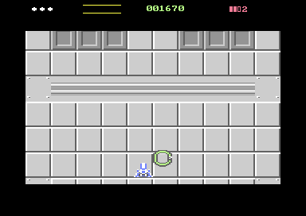

# P-token HUD + economy v1, and deterministic attract colours

**Date:** 2026-09-17
**Starting HEAD:** `7730b6b` — *Boss VIC bank switching, infinite lives toggle added*
**Starting git status:** **clean.** Nothing uncommitted.
**Final git status:** five modified, two new. **Nothing committed or pushed.**

```
 M src/gamestate.asm   M src/hud.asm   M src/main.asm
 M src/pickup.asm      M src/sfx.asm
?? tests/test_p_economy_colours.py   ?? reports/p-token-hud/
```

**Result:** clean build; `tests/test_p_economy_colours.py` **ALL PASS** (44 checks);
`make test` passes everything except the pre-existing `publishSkip` failure.
`tests/test_sfx.py` fails 8 checks — **7 of them fail identically at HEAD** (§10).



Top right: **■■□ 2** after eight pickups — two spendable units banked and two
thirds of the next charged, which is the brief's own worked example.

---

## 1. Files changed

| file | why |
|---|---|
| `src/gamestate.asm` | `gsClearScreen` claims colour RAM; `gsResetRun` resets the charge |
| `src/pickup.asm` | the economy: `pkCharge`, and the award on the third pickup |
| `src/hud.asm` | three-box charge art, the P digit, the celebration, the fake cycling removed |
| `src/sfx.asm` | `SFX_PEARN`; a missing `sfxADTab` row; segment moved for the HUD |
| `src/main.asm` | `hudPTick` in `gameFrame` |
| `tests/test_p_economy_colours.py` *(new)* | the focused proof |

---

# A — deterministic attract colours

## 2. Root cause

`gsClearScreen` filled the **screen matrix only**. The header of
`src/gamestate.asm` said why, and said it confidently:

> COLOUR RAM IS NEVER TOUCHED, and that is what makes the return to gameplay
> free. It is uniformly TERRAIN_COLOUR_RAM…

That was true when `src/terrain.asm` was its only writer. It has not been true
for some time:

- **`src/turrets.asm`** colours a turret's four body cells and only restores
  them to `TERRAIN_COLOUR_RAM` when that body leaves or dies. A turret still
  alive when the level ends leaves its colour behind.
- **`src/boss.asm`** paints the health bar with `BOSS_BAR_FULL = 8 | 2` — **red**
  — across row 1.

So the attract page drew white text straight on top of whatever was left, and a
few letters came back pink. **Colour RAM is not in any VIC bank and is not
double buffered**, so no amount of bank or page discipline could have fixed it:
the page simply had no colour owner.

## 3. The fix

`gsClearScreen` now fills all 1000 cells, in the same loop shape it already used
for the matrix, and the header claim is corrected rather than left to rot.

**The value is `TERRAIN_COLOUR_RAM`, not a text colour**, and that is deliberate:
bit 3 selects multicolour and the low nibble is white, so with `$d016`'s MCM bit
off — which `gsBeginNonGame` guarantees — every cell reads as plain white text
*and* the value gameplay expects to find is restored at the same time. One fill
satisfies both readers, so the "return to gameplay is free" property the old
comment was protecting is kept rather than traded away.

Every page that goes through `gsBeginNonGame` gets it: title, high scores, game
over, initials and level complete. Layout, the 250-frame cycle, the eight score
rows, the initials reverse-video highlight, the FIRE-release gates and the
Infinite Lives `I` toggle and indicator are all untouched.

**Proven** by planting red residue in the boss bar's row *and* across the title
line, entering attract the ordinary way, and finding colour RAM uniform — and
still uniform after a page flip.

---

# B/C — the P economy

## 4. Semantics, before and after

| | before | after |
|---|---|---|
| `pkTokensP` | **raw pickups.** Incremented once per token; level-complete displayed it as "P TOKENS", so eight pickups read as eight P | **spendable units.** What level-complete shows and what an upgrade screen will spend |
| `pkCharge` | — | **0..2**, the partial charge toward the next unit |
| `hudUpgrade` | a placeholder cycling 0→3 every 192 frames, unconnected to anything | gone |

**The name `pkTokensP` was kept on purpose.** `gsResetRun` already described
this byte as the run's "P currency" — it was the *meaning* that was wrong, not
the label — and keeping it means `tests/test_boss.py` and
`tests/test_bank2_arena.py`, which read it to check a value survives a
transition, needed no edit at all.

`PICKUP_P_PER_UNIT` is **derived from `HUD_PCHARGE_MAX`** rather than restated:
`src/hud.asm` is imported first, so one definition serves both and the picture
cannot drift from the economy.

## 5. Award timing

On the third pickup the unit is awarded **at that instruction**, before anything
else happens:

```asm
    inc pkCharge
    lda pkCharge
    cmp #PICKUP_P_PER_UNIT
    bcc !partial+
    lda #0
    sta pkCharge            ← the set is banked...
    lda pkTokensP
    cmp #$ff
    beq !earned+
    inc pkTokensP           ← ...and the unit exists NOW
!earned:
    jsr hudPEarned          ← only then does the HUD start celebrating
    lda #SFX_PEARN
    jsr sfxRequest
```

The celebration is a second during which the game carries on — the player can
die, the level can end, the boss can start — so currency that only became real
at the end of an animation would be currency a transition could lose. **The
authoritative state moves first and the HUD catches up.**

Measured directly: the test reads `pkTokensP` and `pkCharge` on the instruction
after `pickupCollect` returns, before a single frame of celebration has run, and
finds `(1, 0)`.

## 6. Storage and resets

| state | owner | reset by |
|---|---|---|
| `pkTokensP` | `src/pickup.asm` | `pickupInit` (cold boot), `gsResetRun` (new run) |
| `pkCharge` | `src/pickup.asm` | the same two |
| `hudPCharge`, `hudPShown`, `hudPCeleb` | `src/hud.asm` | `hudPReset`, called from `gsResetRun` |

**A death touches none of them** — `playerTakeHit` was not modified — which the
proof checks with a real call to it. Partial charge is preserved through the
current lifecycle exactly as the currency is; no cross-level policy has been
invented, and none was needed.

---

## 7. The HUD

**One existing HUD sprite, HW7** — the slot the placeholder was wasting. No new
hardware sprite, no mux or renderer change.

**The boxes** are four precomputed bitmaps selected by pointer, exactly as the
lives and the old upgrade states were, so changing state is a single byte store
that an interrupt cannot see half-written:

```
state 0  □□□      state 1  ■□□      state 2  ■■□      state 3  ■■■
```

Each box is 4 px wide with a 1 px gap, drawn as an outline when empty so that
"empty" reads as a container rather than as nothing. They occupy the **left
16 pixels**; an assembly-time check keeps them out of the right-hand column.

**The number** is stamped into that right-hand column at run time from
`digitGlyph` — the same numerals the score uses, so there is one set in the
game. It is written into whichever of the four blocks the pointer currently
selects; the other three carry a stale digit nobody can see and are re-stamped
the moment they become current. Two index registers do it — X the block offset
(0/64/128/192, which fits a byte because there are only four blocks), Y the
glyph — so there is no zero page and no self-modification.

**The fake cycling is gone.** `hudDemoTick` no longer touches the slot, for the
same reason the lives placeholder was removed before it: two writers of one
logical value is how a HUD starts disagreeing with the game.

---

# D — flash and jingle

## 8. The celebration

`HUD_P_CELEB_FRAMES = 50`, counted down by `hudPTick` from `gameFrame`.

**The flash is a colour swap, not a second set of bitmaps** — the boxes are
already drawn, so the cheapest readable change is the slot's own colour.
Cadence is `hudPCeleb AND %00001000`: a swap every 8 frames, about six changes
across the celebration, between `$0a` and `$01`. Measured: **51 frames, exactly
two colours**.

**Gameplay is not paused.** No input lock, no collision suppression, no delay to
token-encounter cleanup; the tick is a countdown and a store. It costs five
cycles and an `rts` when nothing is being celebrated, which is nearly always.

**The HUD lags, the economy does not.** `hudPEarned` latches three full boxes and
deliberately does *not* update the number; when the countdown expires the boxes
and the number are both taken from the **authoritative state**, not from an
assumption — so if a new run began during the celebration, the HUD shows the new
run rather than the set that was being celebrated when the old one ended.

## 9. The jingle

**`SFX_PEARN`, id 8, on voice 2** — six rising notes (C E G C E G), eight frames
each, **48 frames ≈ 1 second**, matching the flash.

| | |
|---|---|
| waveform | triangle — a clean bell |
| envelope | attack 0, decay 5 (168 ms), sustain 0, so each note rings and stops by itself |
| gate | **the only effect in the game that moves its gate mid-sweep.** Gate high for seven frames of each note and low on the eighth, so the next note is a genuine retrigger rather than a slur. That per-frame control column was put there for exactly this and had never been used |

**Voice 2 is the right home.** It is the enemy/world channel and already carried
the token chime this replaces. Voice 1 is the gun and voice 3 carries player
damage and the victory launch — putting a reward jingle on either would mean the
player's weapon or the player's death cutting it, or worse, it cutting them.

**Priority:** the Dropper's sonar ping protects itself from *routine* voice-2
traffic. `SFX_PEARN` is added to the short list allowed through (beside
`SFX_KILL`), because the ping is not more important than the events the player
is being told about, and a set completes a handful of times a level. Player
death on voice 3 is untouched and unaffected.

Pickups one and two still play the ordinary `SFX_TOKEN` chime; the third plays
the jingle instead. Proven: voice 2 holds `SFX_PEARN` immediately after the
third pickup and is idle again after the celebration.

---

## 10. Tests run, and results

| gate | result |
|---|---|
| clean build | **pass** |
| `tests/test_p_economy_colours.py` (44 checks) | **ALL PASS** |
| `make test` (engine invariant probe) | all pass except `publishSkip` (pre-existing) |
| `tests/test_sfx.py` | 8 failures — **7 identical at HEAD** (below) |

Selected measurements:

```
new run                          (spend 0, charge 0)   HUD (0, 0, 0)
220 frames, no collection        HUD unchanged         the cycling really is gone
pickup 1 / 2                     (0,1) (0,2)           HUD (1,0,0) (2,0,0), chime
pickup 3, same instruction       (1,0)                 HUD (3, 0, 50), jingle
celebration                      51 frames, colours {$0a,$01}, ptr {$d2,$d5}
after it                         HUD (0, 1, 0)         economy still (1,0)
second set                       (2,0) -> HUD (0,2,0)
a death                          lives 3->2, economy (2,1) unchanged
level complete reads             pkTokensP = 2 after 7 pickups
attract colours                  uniform $9 everywhere, before and after a flip
gameOverrun scrollLate statPageMismatch statPtrMismatch
objDoubleFree objAllocFail       all 0
```

### Unrelated failures, left untouched

- **`tests/test_sfx.py`** fails 8 checks here and **7 at HEAD**, verified by
  building HEAD into `/tmp` with `git archive` and running the same file against
  it. The pre-existing seven include "sfx state is nine bytes" (it is ten, since
  the Dropper ping added `sfxRefused`), the request-accounting identity, the
  legal `(effect, module)` pair table and two `publishSkip`/`schedBuildDefer`
  checks. **The one new failure is its hard-coded sfx segment address**, which I
  moved (§11). The eighth failure differs between runs within the same
  idle/quiet family that already fails at HEAD. Not repaired, not investigated
  further — the file is stale, and the brief rules out test archaeology.
- **`make test` → `publishSkip is zero over 10s of ordinary play`.** Verified in
  earlier reports to fail identically at HEAD.
- **`harness.Vice._boot_to_game` remains flaky** on a finite level — eight fire
  presses with a second of warp each can run whole games and land in
  `GS_INITIALS`. It bit one run of this file; a re-run passed. `harness.py` was
  **not modified**.

### Three test-side flaws I fixed in my own file

1. **Colour RAM is four bits.** The upper nibble is not stored and reads back as
   whatever the bus last carried, so a cell holding 9 came back as `$c9`. The
   first draft reported a perfectly correct fill as a failure.
2. **`call(gsStartGame)` from the attract loop is not the same as reaching it.**
   The lifecycle is a router; dropping into the middle of it from the monitor,
   then free-running a second of warp with nobody at the stick, ran five deaths
   and landed in the high-score state with `gameFrame` no longer running — so
   every celebration check measured a game that had ended. The economy checks
   now run first, in the game the harness already booted.
3. **`call()` is unsafe while another breakpoint is armed** — its `x` can stop at
   `gameFrame` instead of the synthetic return. It now lifts and restores.

No assertion was weakened.

---

## 11. An unrelated bug found, and what I did about it

**`sfxADTab` had seven rows against an `SFX_COUNT` of eight.** `SFX_LAUNCH`
(id 7) has been reading the first byte of `sfxSRTab` — a zero — as its envelope
since it was added, so the victory launch has a 6 ms decay rather than the
3000 ms one `reports/end-level-boss-placeholder.md` describes.

I could not leave the table short, because my own effect is id 8 and would have
landed in the launch's slot. So the launch's row is now **written explicitly as
`$00` — exactly what it reads today** — and nothing that can be heard changes.
Restoring the intended `$1c` is a sound change nobody asked for; it is flagged
here instead.

Three `.if` guards now assert that `sfxADTab`, `sfxPWHiTab` and `sfxLenTab` are
each `SFX_COUNT` rows. Nothing checked before, which is why it went unnoticed.

**One segment moved:** `src/hud.asm` grew past `$1780` when the P economy
replaced the placeholder, so `sfx` moved `$1780` → `$1840` into the 1,000 free
bytes above it, and the HUD's growth guard now names the real boundary. Nothing
in either file is address-sensitive.

---

## 12. Behaviour preserved

One Dropper maximum · the three-pass flight and sonar ping · P spawning at the
exact Dropper death position · initial defender assembly · **killed defenders
stay dead** · protector orbit geometry and stagger · token descent, clipping,
collection and departure · survivor egress · wave suppression and resumption ·
Infinite Lives · player death, fireball, respawn and invulnerability · the boss
and end-level lifecycle · Bank 0/2 ownership · renderer, mux and raster ·
scrolling and turrets.

The only gameplay change is what a collected P is worth.

---

## 13. Manual VICE checks required

Manual play is authoritative for art, cadence, colour and sound. Please verify:

1. **No stray title or high-score colours** after returning from the boss and
   level-complete lifecycle.
2. **Infinite Lives still works** and its indicator still reads correctly.
3. **The HUD changes only when a P is collected** — nothing cycles on its own.
4. **The boxes are readable at C64 scale** (four pixels wide is small).
5. **The third pickup gives full boxes plus about a second of flash and jingle.**
6. **After the celebration the boxes empty and the number increments.**
7. **Gameplay continues normally during the celebration.**
8. **Defenders stay dead** during a P-token defence.
9. **The level-complete P count is spendable currency**, not pickups.

---

## 14. Disk

```
du -sh build/   96K
du -sh .        7.3M
```

---

## 15. Caveat for a future upgrade screen

- **The digit is one column, so it shows 0–9 and caps there.** Three pickups to a
  unit makes ten units a long level, but a second digit would need either a
  second HUD sprite (all six are spoken for) or narrower boxes.
- **`pkTokensP` is the thing to spend**, and it saturates at 255 like every other
  count in this engine. Nothing decrements it yet; the spend path is the upgrade
  screen's to add, and `pkCharge` should be left alone by it — a partial charge
  is not currency.
- **`hudPShown` lags `pkTokensP` for up to 50 frames.** An upgrade screen that
  opens during a celebration should read `pkTokensP`, never the HUD's copy.

**Nothing committed. Nothing pushed.**
