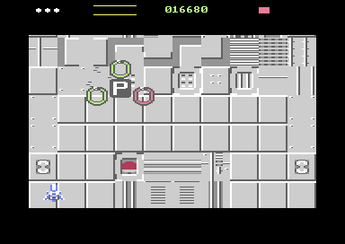
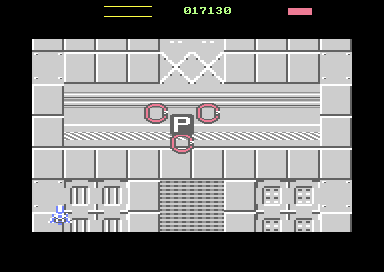
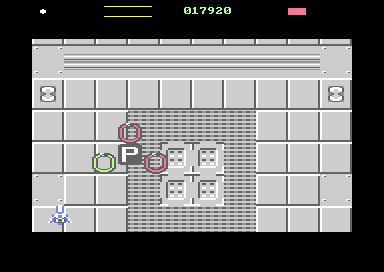

# Token Encounter v2 — Dropper death, the `P`, and its three protectors

**Date:** 2026-09-16
**Starting HEAD:** `d105f77` — *Powerup tokens added*
**Starting working tree:** carried uncommitted changes to `src/enemy.asm`, `src/objects.asm`, `src/pickup.asm`, `src/waves.asm` plus an untracked `src/token.asm`. Every one of those was this task's own in-progress work. **Nothing was reset, cleaned, stashed, committed or pushed**, and no unrelated file was overwritten.

**Result:** the mechanic is complete and works. `tests/test_token_encounter.py` is **ALL PASS** (41 checks). The one failing check anywhere is `publishSkip is zero` in the pre-existing `tests/test_encounter_director.py` — **measured failing at HEAD too, and worse there** (86 at HEAD against 24 here). Per the brief's §10 it was recorded and not investigated — see part 3 §10 and part 8.

**Final working tree** — two new files, five modified:

```
 M src/enemy.asm     M src/main.asm     M src/objects.asm
 M src/pickup.asm    M src/waves.asm
?? src/token.asm     ?? tests/test_token_encounter.py
```

---

## 1. What it does now

Killing the level's one live Dropper drops a `P` where it died. Every enemy on
screen immediately stops flying its authored path: three become **guards** and
walk to posts on a rotating ring around the token, and any surplus is
**dismissed** and leaves under a fast `WM_EXIT`. A missing guard is replaced
from above. Authored wave starts are held for the duration. When the token is
collected or falls off the bottom, reinforcement stops, the survivors leave the
same visible way the surplus did, and the authored stage resumes exactly where
it was paused.





Three captures of one encounter at 70, 130 and 190 frames: the same formation,
three different phases of the ring. These are real emulator frames, not
reconstructions — see part 6 for how they were taken without opening a window.

**The `P` power-up itself is NOT implemented.** Collecting the token does what
it did before; this slice is the encounter around it.

---

## 2. Files changed, and why

| file | why |
|---|---|
| **`src/token.asm`** *(new, 800 B code+tables, 35 B state)* | the whole mechanic: the death hook, role assignment, the ring, reinforcement, dismissal and the ending |
| `src/objects.asm` | `ROLE_NORMAL`/`ROLE_EGRESS`/`ROLE_GUARD`, and `objectZeroSlot` clearing `enyRole` |
| `src/enemy.asm` | guard movement routing in `enemyTick`; the Dropper death hook in `enemyDeathTick`; `tkDropperLive` release in `enemyDespawn`; the shared `logClipAnnotate:` label |
| `src/pickup.asm` | `pkSpawnY` as a spawn parameter; the half-rate descent; the one `jmp logClipAnnotate` that fixes the clipping bug |
| `src/waves.asm` | the authored token column **removed**; the one-live-Dropper rule; the suppression seam in `waveTick` |
| `src/main.asm` | the import, `tokenInit` at cold start, `tokenTick` in `gameFrame`, and a segment guard |
| **`tests/test_token_encounter.py`** *(new)* | the focused proof |

`ROLE_*` lives in `objects.asm` rather than `token.asm` purely because
`enemy.asm` compares against `ROLE_GUARD` and is imported long before the
encounter that owns the behaviour. The pool is where per-slot meanings are
declared, so a per-slot meaning belongs there.

---

## 3. The brief, section by section

### §1 — Dropper uniqueness

One byte, `tkDropperLive`, checked at the single instruction in
`waveSpawnMember` that commits a species to an object — the last moment before
the enemy exists, and the only place the answer can be wrong. It is a
**liveness flag, not a count**, because the question the spawner asks is "is
there one already", and a count that drifted would fail open.

A refused Dropper is **substituted with a Ring, not dropped**. The wave's
shape, count and timing are authored content; silently spawning one fewer
member would quietly rewrite an encounter somebody wrote, where a different
enemy on the same path keeps it.

`enemyDespawn` clears the flag, which is deliberately the *shared* exit for
both ways of leaving: a Dropper that was shot and one that flew off the bottom
both stop being the live Dropper. The species is read **before** `objectFree`,
because `objectZeroSlot` is about to erase it.

Proven: *"never more than one live Dropper"* and *"tkDropperLive agreed with
the pool on every frame"*, both checked on every frame of an ordinary run.

### §2 — The death hook

`enemyDeathTick`'s `!release:` — reached **only** when health hit zero and the
death animation ran out. An enemy that merely flew off an edge is retired by
the despawn rules in `enemyTick` and never arrives there, so **a Dropper the
player let escape drops nothing**. Nothing in the hook reads a sprite pointer,
an animation frame, a colour or any VIC state: `enySpecies` is the identity and
`objHP` reaching zero is the event.

**The allocation policy is the order of operations, and there is no queue.**
The position is captured first (because `objectFree` zeroes the slot), then the
slot is released, and only then is the token asked for. That *guarantees*
capacity: the object that just died was occupying exactly the slot the token
needs, so the pool cannot refuse a reward the player earned. This is the
"prefer ensuring capacity during transition" the brief asked for, bought for
nothing. `tokenDropperDied` still copes if `pickupSpawn` somehow refuses — the
encounter simply does not start, which is the safe direction.

`tkActive` guards against a second token per death.

Proven: exactly one token, at `(162,70)` against a death at `(162,70)`;
`pkSpawned` moved by exactly one; the token is the slot `tkSlot` names.

### §3 — The protector transition

One pass in slot order, deterministic. The first three eligible enemies take
the posts and everything after is dismissed, which covers all three cases
without any of them being a special case:

| population at death | what happens |
|---|---|
| fewer than three | every survivor is posted **and starts walking on that frame**; the deficit is made up by reinforcement |
| exactly three | all three posted, nothing dismissed |
| more than three | three posted, the surplus dismissed |

A **dying** enemy is not eligible: `objHP == 0` means its slot is about to go
back, and posting it would create a guard that vanishes seconds later and an
immediate pointless reinforcement.

**Reinforcements are never Droppers** — `tokenReinforce` writes `SPECIES_RING`
unconditionally. A reinforcement that dropped a second token would turn one
encounter into an unbounded chain.

The first deficit is filled **immediately** (`tkReinforce = 1` at encounter
start, not `TK_REINFORCE_FRAMES`): the interval paces replacements during a
fight, but the transition itself has to look decisive, and a nearly-empty
screen would otherwise stand undefended for half a second at the exact moment
the player is looking at it.

### §4 — Protector behaviour

**One byte per pool slot, `enyRole`, and it is never inferred.** Not from
species, sprite pointer, colour, wave, movement mode or pool index — every one
of which is shared, authored, or rewritten by gameplay. The role also *carries
the station*: `ROLE_GUARD + 0/+1/+2` are the three posts, so "is this a guard"
and "which post" are one load and one compare rather than two bytes that could
disagree. `objectZeroSlot` clears it, so a recycled slot cannot inherit a role.

The movement is deliberately the cheapest thing that reads as defending:
**walk toward one point on a rotating ring, snap when inside one step.**

| constant | value | why |
|---|---|---|
| `TK_ORBIT_STEPS` | 12 | three divides it, so the posts are exactly 4 phases apart and come out of one table with an add |
| `TK_RADIUS_X` / `TK_RADIUS_Y` | 30 / 20 | flattened on purpose: the player approaches from below, and a circular ring would hide the token behind a guard exactly when the player is lining up |
| `TK_STEP` | 3 px/frame | crosses the playfield in about a second; also the snap threshold, which is what stops oscillation about an unreachable target |
| `TK_ORBIT_HOLD` | 10 frames | **derived, not chosen by eye**: a phase is 2π·30/12 ≈ 15.7 px of arc, and 10 × 3 px = 30 px of available travel. A shorter hold would set a target the guard can never reach and the ring would stretch into a lagging comma |

A full revolution is 120 frames — 2.4 s of PAL, a patrol rather than a spin.

Everything is logical coordinates. The token's position is cached **once per
frame** in `tokenTick`, so every guard in a frame reads the same settled
answer; chasing a position that moved mid-walk would make the ring wobble by
the token's own step.

The ring **target** is clamped to `[28, 330]`, not the guard — `logX` is
unsigned, so a post at −6 would not be off-screen, it would be at 250 on the
far side. Clamping the target means a guard whose post is clamped stacks
against the edge with the others still spread.

Guards stay ordinary objects: same pool, same art, same health, same collision,
same despawn rules. Proven: *"a guard is an ordinary enemy throughout"*, and a
guard was killed mid-encounter to prove it.

### §5 — Maintaining three

`tokenFreePost` returns the lowest unfilled post; `tokenTick` attempts **one**
replacement per `TK_REINFORCE_FRAMES` (24) expiry — never a retry loop inside a
frame. A pool that is momentarily full costs one replacement and the timer
starts again, which is exactly what bounds it. `tkDenied` counts a refusal so
the loss is visible rather than silent.

Measured: a guard killed mid-encounter was back to three **13 frames** later,
and the encounter never held more than three at any point.

### §6 — Suppressing normal traffic

**The smallest seam I could find, and it pauses rather than skips.** In
`waveTick`, a trigger that has come due while `tkActive` is walked forward to
`worldProgress` instead of firing — one 16-bit copy. The cursor does not move
and `worldProgress` is untouched, so the trigger stays exactly due, never
accumulates a backlog, and fires on the frame the encounter ends: **one** wave
on the next tick, not a burst of every wave the encounter outlasted.

The director was not rebuilt and nothing else in it knows encounters exist;
deleting `token.asm` would leave one dead branch.

Separately, `tokenDropperDied` **cancels wave instances still mid-send**
(`wvActive`/`wvLeft` to zero). Those would otherwise keep feeding ordinary
enemies into an encounter that is supposed to be exactly three defenders, and
the director's own semantics already allow a wave to be lost — `waveStartNext`
drops one whenever both instances are busy.

Proven: `wvStarted` did not move for the whole encounter (74 → 74) and moved
again afterwards (74 → 75).

### §7 — The end of the encounter

`tokenTick` ends the encounter the moment the token's slot is no longer a live
`TYPE_PICKUP`. **Collection and falling off the bottom both produce exactly
that**, so there is one ending, not two. The type is checked as well as the
membership bit because the slot may already have been handed to something else.

Survivors are **dismissed into the same egress the surplus used** — they keep
their slot, health, art and collision, fly a terminal `WM_EXIT` at 6 px/frame,
and are retired by the ordinary despawn rule. The screen empties the way it
filled: visibly, and the player can still shoot them on the way out.

Proven: one dismissed enemy was tracked from `logY` 19 to 247 before the
despawn rule took it.

### §8 — Descent cadence *(provisional — report requested)*

**One pixel every two frames.** `pickupTick` gates the existing `PICKUP_VY`
add on `frameCounter & 1`. A frame-counter bit, not a fractional velocity: no
accumulator, no per-token byte, no sub-pixel machinery, and every token on
screen moves on the same frames.

It was one pixel *per* frame, which matched the scroll exactly — right when a
token was scenery to steer into, wrong now that it is the prize at the centre
of a three-enemy encounter. At the old rate it crossed the aperture in under
four seconds, barely time for reinforcement and egress to be seen at all. The
token no longer matches the scroll, and that is now correct: it should read as
an object hanging in the encounter rather than as part of the ground.

Measured exactly, against the machine's own frame counter: **178 px over 356
frames.**

This is not final balance. The rate lives in one constant for that reason.

### §9 — The clipping bug

**Fixed, and the fix is one instruction.** `pickupTick` now ends
`jmp logClipAnnotate`.

The investigation confirmed what the brief suspected: the clip path is
**entirely type-agnostic**. The schedule builder reads `logClip,y` for any
entry, the presentation-Y clamp and the scratch pool never asked what type
anything was, and `src/clip.asm` renders from whatever `logPtr` names. A token
was never clipped for one reason only — **it never wrote the annotation**, so
it was admitted whole or not at all and vanished in one step at the bottom
edge. This was an eligibility fix, not a clipping change. No token-specific
clipping exists anywhere.

The routine in `src/enemy.asm` was given the label `logClipAnnotate:` so it can
be called rather than copied; `enemyTick` still falls straight into it, and
nothing in it is enemy-specific — it reads `logY` and writes `logClip`.

Proven: on every frame the token was below `MAX_SPRITE_Y`, its `logClip`
matched the aperture rule exactly, including the cull-to-zero once the whole
sprite is past the edge.

### §10 — The old `publishSkip` measurement

Not investigated and not optimised, as instructed. But the catastrophic smoke
(`tests/test_encounter_director.py`) asserts `publishSkip == 0`, and it fails —
so I did the one thing needed to report the number honestly rather than
interpret it blind: **measured the same test against a build of HEAD.**

| build | `tests/test_encounter_director.py` | 40 s warp free-run |
|---|---|---|
| HEAD `d105f77` | `publishSkip` **86** — FAIL | **255** (saturated) |
| working tree | `publishSkip` **24** — FAIL | **65** |

The failure is **pre-existing and this slice makes the number smaller, not
larger.** HEAD was built into `/tmp` from `git archive` so the working tree was
never touched. Every other counter — `gameOverrun`, `schedBuildDefer`,
`scrollLate`, `edgeLate`, `objDoubleFree`, `objAllocFail` — is **zero in both
arms and in the token proof**.

No assertion was weakened, no test was repaired, and the A/B was two short runs
rather than a benchmark suite.

### §11 — Wave ownership

**There was no per-member ownership to unwind, and that is the finding.**
`waveRunInstance` frees a wave instance when its last member is **sent**, not
when its members die — so a wave has already let go of an enemy long before the
encounter could take it. The only thing that had to change was the **movement
source**.

So the transition is one branch in `enemyTick`: a slot whose role is
`ROLE_GUARD` or above calls `tokenGuardMove` instead of `wmTick`. No movement
program runs, no stage advances, and nothing in `src/movement.asm` has to know
roles exist. An old instance cannot be left permanently blocked because there
is no blocking state to leave behind.

The one real ownership concern — an instance still **mid-send** when the
encounter starts — is handled by the cancellation in §6 above, which touches neither
the trigger cursor nor `worldProgress`.

A dismissed enemy is deliberately **not** routed away: `ROLE_EGRESS` is flown
by the ordinary `wmTick`, because the encounter gave it a terminal `WM_EXIT`
and the movement interpreter already knows how to fly one of those.

### §12 — Protector firing *(decision requested)*

**Wave-authored firing is withdrawn when an enemy becomes a guard or is
dismissed** (`tokenSilence` writes `ENEMY_FIRE_NONE`). This is the choice the
brief guessed at, and the reason is that the permission was resolved against a
*path*: `waveSpawnMember` decides whether a member fires from the authored mask
and the species' capability, knowing the path that member will fly. A guard is
no longer on that path — it hovers near the player instead of crossing the
aperture once — so the same authored byte would produce a completely different
volume of fire.

This is a decision about the encounter, not about firing. `src/ebullet.asm` and
the firing tick are untouched, **no protector-specific pattern exists**, and an
enemy that returned to no role would simply have no permission rather than a
wrong one.

### §13 — SFX

**Unchanged.** Not one byte of `src/sfx.asm` was touched. No Dropper death
fanfare, no protector sounds, no new effect ids.

---

## 4. Memory cost

Exact, from the assembler's own segment map, HEAD against the working tree.

### New segments

| segment | range | size |
|---|---|---|
| `token encounter` (code + tables) | `$5400–$571f` | **800 B** |
| — of which the orbit tables | `$56fc–$571f` | 36 B |
| `token encounter state` | `$c440–$c462` | **35 B** |
| — of which `enyRole` | `$c453–$c462` | 16 B |

### Growth in existing segments

| segment | HEAD | now | delta |
|---|---|---|---|
| `enemy code` | `$4900–$4a03` | `$4900–$4a40` | **+61 B** |
| `pickup code` | `$4d00–$4e12` | `$4d00–$4e1c` | **+10 B** |
| `waves` | `$7c00–$7f1e` | `$7c00–$7f24` | **+6 B** |
| `main` | `$5000–$5299` | `$5000–$529f` | **+6 B** |
| `object pool` | `$4800–$48e0` | `$4800–$48e3` | **+3 B** |
| `pickup state` | `$c4c0–$c4d7` | `$c4c0–$c4d8` | **+1 B** (`pkSpawnY`) |

**Total: 886 B of code and data, 36 B of state.** `build/shmup.prg` is
unchanged in file size at 51,164 bytes (the image spans fixed segment bounds).

`waves` grew by 6 bytes *net* — the uniqueness rule cost more than removing the
two `waveTrigToken` tables and the authored spawn block saved.

### Where the code went, and why it moved

`token.asm` was first placed at `$4e20`, in the 238-byte gap between the pickup
code and `main`. **It did not fit** — the encounter is 800 bytes — so it moved
to `$5400`, in the run above `main` (which ends at `$529f`) and below the
terrain map data at `$5800`. That leaves `main` 352 bytes of growth beneath it
and the encounter 224 above. Both bounds are **hard assembler errors**, not
comments: a new guard was added to the end of `src/main.asm`, and `token.asm`
carries its own.

```
du -sh build/   88K
du -sh .        5.6M
```

---

## 5. The focused proof

`tests/test_token_encounter.py`, **one VICE launch, ALL PASS** (41 checks).

**The only thing it stages is a death**, and it stages it the way
`src/collision.asm` does: `objTimer` to `DEATH_TIME` then `objHP` to zero,
which *is* the logical destruction event. Everything downstream — the species
test, the position capture, the slot release, the token spawn, role assignment,
reinforcement, suppression and the ending — is production code running in the
production frame loop. Nothing about the token, the roles, the waves or the
movement is poked into place.

There is one other poke, and it is documented in the file: the **ship is moved
out of the token's column**. The ship idles at X=160 and an authored Dropper
very often dies within a few pixels of that, so the token is collected around
`logY` 210 — which ends the encounter correctly but hides the last forty rows
of the descent, and with them the entire bottom-edge clipping this slice
exists to fix. The player is not part of the mechanic under test; standing in
the token's column is.

No enormous Python simulator was written. The proof is one file that watches
state.

### Three harness bugs it found in itself — worth recording

The first three runs failed loudly, and **every failure was in the test, not
the game.** Each is written up in the file at the point it bit:

1. **Wrong array stride.** `logY`/`logX`/`logXHi` are `MAX_LOGICAL` (32) wide,
   not `MAX_OBJECTS` (16). Reading them sixteen apart reads `logY`'s second
   half as `logX` — which is why the first run reported a Dropper at X=28160.
2. **A silently dropped monitor write.** `poke` is the one command with no
   reply to check. The `objHP` write landed and the `objTimer` write did not,
   giving `objHP == 0` with `objTimer == 0` — a state `src/objects.asm`
   documents as impossible, and which `DEC` turns into a **256-frame** death
   animation. Every measurement afterwards described a machine that had not yet
   done the thing being measured. Writes are now read back and retried.
3. **`step_n` de-duplicates within one call only.** Calling it as
   `step_n(..., 1, ...)` in a Python loop resets its `prev` every time, so it
   accepts duplicated stops and de-duplicates nothing. The trace was
   unambiguous — the frame counter repeated `(14301, 14301)` while the death
   timer moved underneath it, so a 12-frame death animation looked like 24.
   Replaced with a `Stepper` that carries the frame across steps and judges each
   sample by **its own** frame counter, read last.

That third one matters beyond this file: **any test that calls
`harness.step_n` with `n=1` in a loop has the same hole.** I have not changed
`harness.py` or any other test — recorded, not repaired.

### What it proves

Uniqueness · no token without a death · the death hook and its exact position
capture · exactly one token · reorganisation into three posts · surplus and
survivors both leaving visibly under `WM_EXIT` and reaching the despawn rule ·
convergence (closest approach 11–17 px) · patrol (**all four quadrants** swept
about the token, by each of the three guards) · a guard remains an ordinary
enemy · replacement in 13 frames · never more than three · suppression and
release · descent cadence 178 px / 356 frames · bottom-edge clipping matching
the aperture rule on every frame · the ending counted once · the health
counters clean.

### What it does not prove

Whether the ring is the right size, whether the descent feels right, whether the
transition reads as deliberate. Those are judgement, and the brief's §8 says
the cadence is provisional anyway.

---

## 6. Visual verification

**Headless, via `-exitscreenshot`** — `-console` means no window is ever mapped,
so nothing stole macOS focus. A small scratch script steers a run to a chosen
frame of an encounter (the same staging as the proof), stops at the breakpoint,
and quits cleanly so the emulator writes the canvas as a PNG.

One trap worth recording: the first capture resumed for 0.4 s of wall time
before quitting "so the canvas would be a live frame". In warp that is tens of
thousands of frames, and the image showed a screen long after the encounter had
ended. The canvas already holds the last frame drawn before the breakpoint
stopped the machine, so the fix was to remove the resume.

The three images in §1 are frames 70, 130 and 190 of one encounter. The logical
state behind the first: token at `(114,103)`, guards at `(88,113)`, `(140,113)`
and `(114,83)` — a triangle about the token at the authored radii. The `P` is
legible, the rings are distinct from it, and the formation holds through three
different ring phases.

**Free-flying manual play remains the user's call** and is the authoritative
judgement on whether the patrol *feels* coherent — `make run` is unchanged.
What is reported above is what the emulator actually drew, not a reconstruction.

---

## 7. VICE hygiene

Every automated launch used `-console +saveres` with **no `-default`**, no
joystick-disable overrides, and an explicit remote-monitor port. Ownership was
by exact PID through `harness.Vice`, which refuses to attach to a port it did
not open and reaps what it launched; the capture script does the same. No
`pkill`, no pattern-matched kill, nothing that could touch a manual VICE.

`pgrep -fl x64sc` was run before and after: **none running at the start, none
running at the end.** Every launched PID is named in its run's output and was
reaped. Temporary logs, the baseline build and the captures were written under
`/tmp` and the session scratchpad; the three images kept for this report were
copied into `reports/token-encounter-v2/`.

---

## 8. Observations — out of scope, recorded only

1. **`tests/test_pickup.py` now encodes retired v1 semantics.** It is the
   direct casualty of §2 and §8 and it was **not touched**. Three specific
   things in it no longer describe the game:
   - it reads `sym["waveTrigTokenLo"]` / `waveTrigTokenHi` (lines 147–148).
     Those emission tables are gone, so it will raise `KeyError`, not fail a
     check;
   - `AUTHORED_X` and the "a trigger authored with a token spawns exactly one"
     checks assert the authored-token behaviour §2 removed;
   - "the token descends exactly one pixel per frame" asserts the cadence §8
     halved.

   Deciding what that file should now say is a content decision, not a
   mechanical fix, and the brief put test-suite work out of scope. Flagged for
   the user.

2. **`publishSkip` is non-zero at HEAD**, and `tests/test_encounter_director.py`
   asserts it is zero. Pre-existing, measured both ways (part 3 §10), untouched per the brief's §10.

3. **`harness.step_n` has a de-duplication hole when called with `n=1`** in a
   loop (part 5). Not repaired. `tests/test_encounter_director.py` calls it exactly
   that way.

None of these were caused by this slice except (1), which is its intended
consequence.

---

## 9. Non-goals honoured

No final balance. No formation AI, steering behaviour or pathfinding. No
protector-specific firing patterns. No new pickup art. **No actual `P`
power-up.** No renderer or mux redesign. No `publishSkip` optimisation. No
test-suite cleanup and no unrelated fixes. No general deferred-object queue.
**Nothing committed, nothing pushed.**
