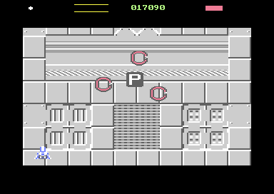
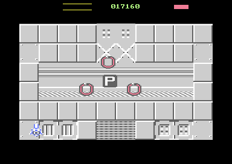

# Token Encounter v2.1 — wider, smoother protector orbit + safe upward exit

**Date:** 2026-09-16
**Starting HEAD:** `d105f77` — *Powerup tokens added* (unchanged; nothing committed)

**Starting working tree:** the v2 slice, uncommitted — `src/enemy.asm`, `src/main.asm`, `src/objects.asm`, `src/pickup.asm`, `src/waves.asm` modified; `src/token.asm`, `tests/test_token_encounter.py`, `reports/token-encounter-v2-protectors.md` and `reports/token-encounter-v2/` untracked.

**Final working tree:** the same set, plus this report and its captures. No reset, clean, stash, commit or push; no unrelated file touched.

```
 M src/enemy.asm     M src/main.asm     M src/objects.asm
 M src/pickup.asm    M src/waves.asm
?? src/token.asm     ?? tests/test_token_encounter.py
?? reports/token-encounter-v2-protectors.md   ?? reports/token-encounter-v2/
?? reports/token-encounter-v2.1-presentation.md
?? reports/token-encounter-v2.1/
```

**Result:** build clean, focused proof **ALL PASS** (44 checks), no unrelated test run or modified.

---

## 1. Orbit constants, before and after

| constant | v2 | v2.1 | why |
|---|---|---|---|
| `TK_RADIUS_X` | 30 | **46** | brief asked 44–48; the ring read as decoration on the P rather than a patrol around it |
| `TK_RADIUS_Y` | 20 | **30** | brief asked 28–32; keeps the flattened shape that leaves the player's approach open |
| `TK_ORBIT_STEPS` | 12 | **24** | halves the arc per phase, so every direction change is half the size |
| `TK_ORBIT_SPAN` | 4 | **8** | unchanged as an angle: still exactly a third of the ring, 120° |
| `TK_ORBIT_HOLD` | 10 frames | **4 frames** | matched to the step rate — see below |
| `TK_ORBIT_PERIOD` | — | **96 frames** (new) | one revolution, 1.92 s PAL (was 120 frames / 2.4 s) |
| `TK_STEP` | 3 px | 3 px | unchanged |
| `TK_X_MIN` / `TK_X_MAX` | 28 / 330 | 28 / 330 | unchanged; the target-clamp concept is untouched |

Measured standoff, from the real machine: **28–46 px** (v2's ellipse could only reach 20–30).

---

## 2. Why v2 read as a rigid triangle, and what changed

Two independent causes, and the radius was neither of them.

**Cause 1 — dwell.** A phase of v2's ring was 15.7 px of arc, but a guard covers 3 px a frame for all 10 frames of the hold: 30 px of travel for 15.7 px of demand. So each guard *arrived* in about five frames and then **sat still for five**. The eye sees the still half.

v2.1 matches the two. The 46×30 ellipse is ~241 px round, so a phase is 241/24 ≈ **10.1 px** of arc, and the steepest quarter demands 12.0 px on one axis. Four frames × 3 px = **12 px available**. The guard is moving on very nearly every frame.

**Cause 2 — simultaneity.** v2 held a phase index plus one shared countdown, so all three guards turned over on the *same frame*, by construction.

v2.1 replaces both bytes with one free-running frame counter, `tkOrbit`, and each guard derives its own phase from it:

```asm
    lda enyRole,x
    sec
    sbc #ROLE_GUARD         ; p = 0..2
    tay
    clc
    adc tkOrbit             ; THE STAGGER: + p frames
    cmp #TK_ORBIT_PERIOD
    bcc !noWrap+
    sbc #TK_ORBIT_PERIOD
!noWrap:
    lsr
    lsr                     ; / TK_ORBIT_HOLD  -> phase 0..23
    sta tkTmp
    tya
    asl
    asl
    asl                     ; THE STATION: + p * TK_ORBIT_SPAN
    clc
    adc tkTmp
    cmp #TK_ORBIT_STEPS
    bcc !phase+
    sbc #TK_ORBIT_STEPS
!phase:
    tay
```

Two offsets doing different jobs. The **station** (`p * 8`) keeps the deterministic 120° distribution v2 had. The **stagger** (`+ p` frames, applied *before* the shift) moves the frame each guard turns over on: post 0 on frames 0, 4, 8…, post 1 on 3, 7, 11…, post 2 on 2, 6, 10… — no two ever change direction together. It costs one `adc` because the clock is already in frames.

The hold must be a power of two for that shift; there is a `.error` guard saying so, and another that `TK_ORBIT_SPAN` is 8 because the multiply is three `ASL`s.

**Measured:** all three guards were stationary on the same frame **0 out of 259** settled frames (0.0%). Worst adjacent angular gap **84°** (nominal 120°; the ellipse is not angle-preserving).

No trigonometry, steering, pathfinding, fixed-point or spline was added. The orbit is still a lookup table — just twice as long.

---

## 3. Upward exit — exact implementation

**No new movement mode, no new role.** `src/movement.asm` documents `WM_EXIT` as terminal and as *keeping whatever velocity it inherits* — it has no direction of its own — and `wmApplyVelocity` integrates `wmVY` through the same signed arithmetic-shift path as `wmVX`. So "leave upward" is a negative byte:

```asm
tokenDismissUp:
    lda #256 - TK_EGRESS_UP_VY          // two's complement: upward
    jmp tokenDismissAt
tokenDismiss:
    lda #TK_EGRESS_VY
    // falls through
tokenDismissAt:
    sta wmVY,x                          // consume A at once: no scratch needed
    ...
```

Two entry points, one body. `tkTmp` is deliberately *not* used to pass the velocity — `tokenAssignRoles` is holding the next post in it while it calls this.

| | speed | used by |
|---|---|---|
| `TK_EGRESS_VY` | 24 qpx = 6 px/frame **down** | surplus dismissed at encounter **start** — **unchanged** |
| `TK_EGRESS_UP_VY` | 32 qpx = 8 px/frame **up** (new) | survivors at encounter **end** |

`tokenEnd` now calls `tokenDismissUp`. Faster than the downward egress because this is cleanup: the reward is banked and the screen should be given back promptly. Survivors stay ordinary enemies — same slot, health, art, collision — and are retired by the ordinary despawn rule.

### The despawn edge that had to exist

`src/enemy.asm` had **three** despawn edges (left, right, bottom) and deliberately **no top one**: every wave spawns above the aperture and flies down into it, so a position-only top rule would free every enemy in the game on its first frame. Nothing had ever left upward before.

The new rule mirrors the side rules exactly — it asks *which way the enemy is going*, which is the same argument the file already makes for the left and right borders:

```asm
!checkVertical:
    lda logY,x
    cmp #ENEMY_CLEAR_Y
    bcs !gone+                          // below the bottom: gone either way
    cmp #ENEMY_CLEAR_Y_TOP
    bcs !alive+                         // inside the band: the common case
    lda wmVY,x
    bmi !gone+                          // still travelling up: it has left
    bpl !alive+                         // descending or parked: arriving
```

`ENEMY_CLEAR_Y_TOP = ENEMY_HIDDEN_Y + 1 = 35` — the mirror of `ENEMY_CLEAR_Y = 248`, and `ENEMY_HIDDEN_Y` already existed and already meant "the last Y at which a sprite is entirely above the aperture". Cost is **+4 cycles per enemy per frame** (one `cmp` and one branch on the common path); the bottom test shares the existing `lda`.

The same rule was added to `src/waves.asm`'s **assembly-time termination proof**, which mirrors the runtime rules so an authored pattern that never reaches an edge is a build error. The build passes, which proves no authored pattern crosses the top line while ascending.

### One latent v2 bug fixed on the way

A guard's position is written directly by `tokenGuardMove`, which replaces `wmTick` — so its `wmVX`/`wmVY` sit **frozen at whatever heading the wave left behind**, and those bytes are *not* dead: the despawn rules read them to tell arriving from leaving. A guard patrolling near the left border while carrying a stale leftward `wmVX` would have been retired mid-patrol in v2, and with the new top rule a stale upward `wmVY` would do the same — which the taller ring now makes reachable.

New `tokenHalt` zeroes `wmVX`/`wmVY`/`wmAccX`/`wmAccY` at the moment a post is taken. A stationary velocity is the truth about a guard: it is not travelling anywhere, it is being placed.

---

## 4. Initial surplus dismissal — preserved

**Unchanged, deliberately.** Surplus enemies stood down at Dropper death still leave *downward* at 6 px/frame through `tokenDismiss`. That happens the instant the Dropper dies, with the player still wherever they shot it from — usually below and clear — so the danger the upward rule exists to remove does not apply. The brief said not to change it merely for symmetry, and it was not changed.

The proof asserts both directions separately: no end-of-encounter survivor descends, and the surplus path still sets `WM_EXIT`.

---

## 5. Code / data / state delta

Against the v2 slice (not against HEAD — v2 is uncommitted).

| segment | v2 | v2.1 | delta |
|---|---|---|---|
| `token encounter` | `$5400–$571f` 800 B | `$5400–$575a` **859 B** | **+59 B** |
| — orbit tables | 36 B (12 phases × 3) | **72 B** (24 × 3) | +36 B |
| `enemy code` | `$4900–$4a40` 321 B | `$4900–$4a4b` **332 B** | **+11 B** |
| `waves` | `$7c00–$7f24` 805 B | `$7c00–$7f24` **805 B** | 0 (assembly-time only) |
| `token encounter state` | `$c440–$c462` 35 B | `$c440–$c461` **34 B** | **−1 B** |

**Total: +70 B of code and data, −1 B of state.** The state shrank because `tkOrbitTimer` is gone: v2 held a phase index *and* a countdown — two bytes that had to agree, and whose agreement was what synchronised the guards.

Segment guards all still hold; `token encounter` has 165 B of headroom below the terrain map at `$5800`.

```
du -sh build/   88K
du -sh .        5.7M
```

---

## 6. Build

Clean, first time after the constants change, and clean again after every subsequent edit. No warnings, no overlaps. The `waves.asm` assembly-time flight proof passes with the new fourth despawn rule.

---

## 7. Focused check

`tests/test_token_encounter.py` — **ALL PASS, 44 checks, one VICE launch.** The v2 file updated in place rather than a new harness.

Everything v2 proved still passes unchanged: uniqueness, the death hook and its exact position capture, exactly one token, three posts, reinforcement in **13 frames**, suppression (`wvStarted` 58 → 58) and resume (58 → 59), descent cadence **161 px over 321 frames**, bottom-edge clipping, and every catastrophic counter at zero.

New v2.1 evidence:

| check | measured |
|---|---|
| ring is as wide as the constants say | widest standoff **46 px** (wanted ≥ 40; v2's widest was 30) |
| never collapses onto the token | closest standoff **28 px** (wanted ≥ 24) |
| three guards stay spread, not bunched | worst adjacent gap **84°** over 259 settled frames (wanted ≥ 70) |
| never all stationary together | **0 / 259** settled frames (0.0%, wanted ≤ 8%) |
| a survivor visibly ASCENDED | slot 1 **195 → 35**, slot 3 **231 → 39** |
| none travelled down through the player | **no** descending runs |
| and left by the ordinary despawn rule | both retired at the top edge |

### Two test-side corrections made while getting there

Both were the test measuring the wrong thing; neither was a game bug.

1. **The ending had to change.** v2's run moved the ship aside so the token fell off the bottom — which proves the clipping, but ends the encounter with *nothing left to send anywhere*: the ring follows the token down, so by the time it despawns at 250 the guards have already left through the bottom on their own. The run now banks four frames of clipped descent and then steers the ship onto the token at **y = 232**. The aperture ends at 226 and the ±20 collection box round the ship's fixed y=220 reaches 240, so that single window proves the clipping **and** leaves live guards around the ship — which is also the case the player actually meets, and the one v2 got wrong.

2. **A reinforcement in transit is not a bunched formation.** A replacement guard enters at the token's own column and walks *down through the ring* to its post, so for a few frames it sits inside the ring band at whatever angle it is crossing — usually straight above another guard. Sampling those frames reported a 4° spread and a 22 px standoff. The formation statistics are now gated on guards that have been posted for ≥ 45 frames, and the counter resets when a slot stops being a guard so a reissued slot cannot inherit its predecessor's settled status.

---

## 8. Short smoke — visual

Two headless captures (`-console`, no window mapped, nothing stole focus), stored beside this report:




Logical state behind them, straight off the machine:

```
90f   token (169,116)  guards (178,87) (202,137) (123,120)   radii 30, 39, 46
150f  token (162,139)  guards (122,154) (162,109) (199,156)  radii 43, 30, 41
```

Those are exact rows of the generated 24-phase table. The `P` is clearly legible and clearly reachable inside a visibly more open ring than v2's.

---

## 9. Unrelated failures

**None encountered, because none was run.** No regression, baseline, worktree or repeated-VICE campaign; no `publishSkip` comparison; no old token A/B. `tests/test_pickup.py` and `harness.step_n` remain as recorded in the v2 report — untouched, and still the user's call.

`publishSkip` is printed by the focused proof as information only (**26**) and is not asserted there. It was not investigated.

---

## 10. VICE hygiene

Every launch used `-console +saveres`, no `-default`, no joystick-disable overrides, an explicit monitor port, and PID ownership through `harness.Vice` / the capture script — which refuse to attach to a port they did not open and reap what they launched. No `pkill`, no pattern-matched kill.

`pgrep -fl x64sc` before and after every run: **none running at the start, none running at the end.** Temporary captures, the v2 baseline build and the segment dumps under `/tmp` have been deleted; the two images kept are in `reports/token-encounter-v2.1/`.

---

## 11. Still requiring manual judgement

Manual VICE is authoritative for all of these — the numbers above say the mechanism is right, not that it looks right.

1. **Does the orbit now read as circulation?** 0% lockstep and 84° spread say it should; whether 96 frames a revolution feels like a patrol or a drift is a judgement.
2. **Is 46 × 30 the right size?** It is mid-range of what the brief asked. The P stays clearly accessible in both captures.
3. **Token near a playfield edge.** The target clamp is unchanged, but a wider radius means posts clamp *sooner*, so two guards can stack against the border when the token is near one. Not seen in testing (the token fell at x≈162); worth watching if a Dropper dies near an edge.
4. **Is the upward exit fast enough?** 8 px/frame clears mid-aperture in ~15 frames.
5. **The guards that leave through the bottom on an uncollected P.** When the token is *not* collected, the ring has followed it so far down that the lower guards reach the bottom despawn line on their own before the encounter formally ends — so they exit downward, by the ordinary rule, not by dismissal. The player is not in that airspace at that moment (the token was missed), so this was left alone rather than special-cased; flagging it as the one place a protector still leaves downward.

---

## 12. Unchanged, as required

Dropper uniqueness · death hook · token spawn at death position · exactly-one-token · reinforcement to three · replacement of killed protectors · normal-wave suppression and resume · P descent cadence · P collision/collection · P counter · P art · token SFX · protector firing policy · enemy firing system · clipping implementation · mux/renderer/raster · projectile cap · the actual `P` power-up (still not implemented).

**Nothing committed. Nothing pushed.**
